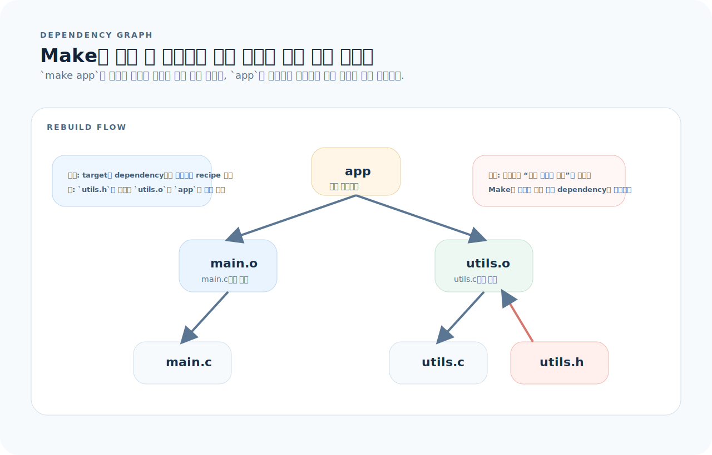
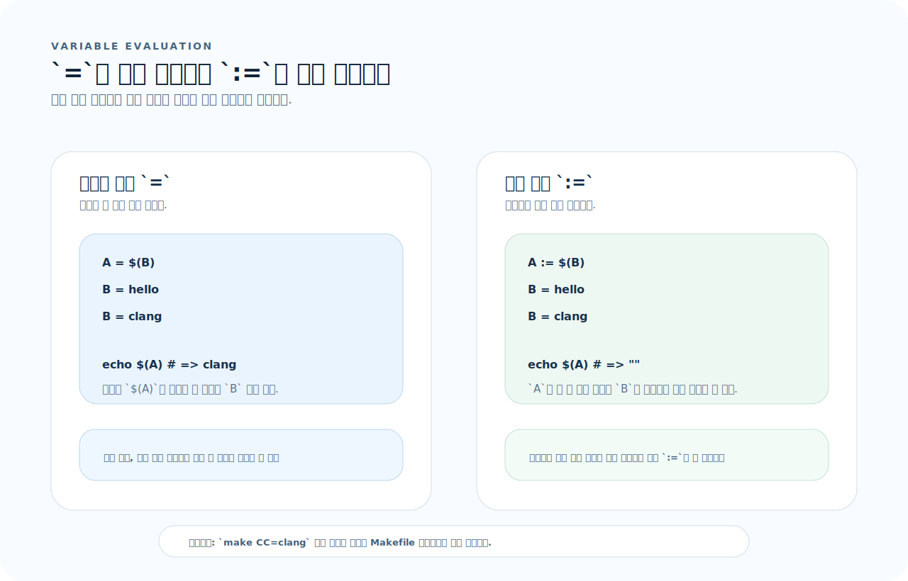
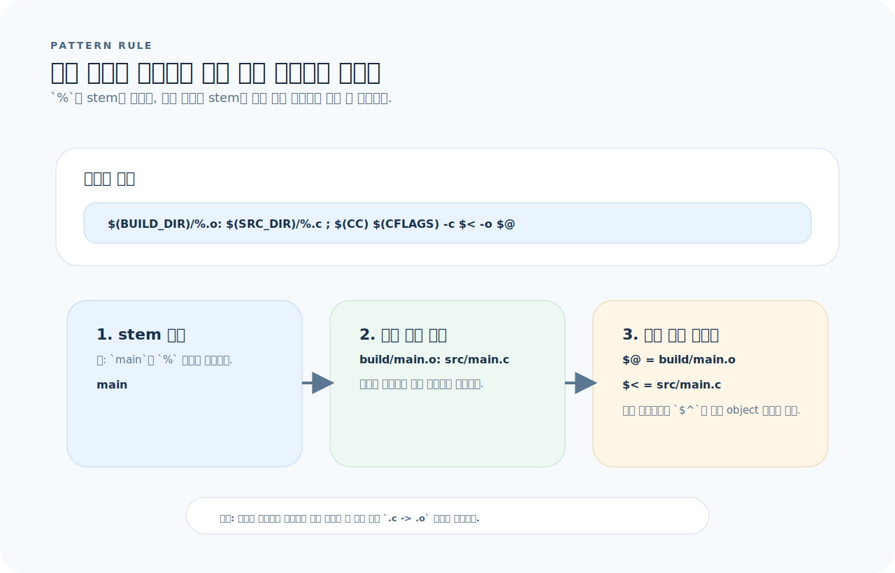
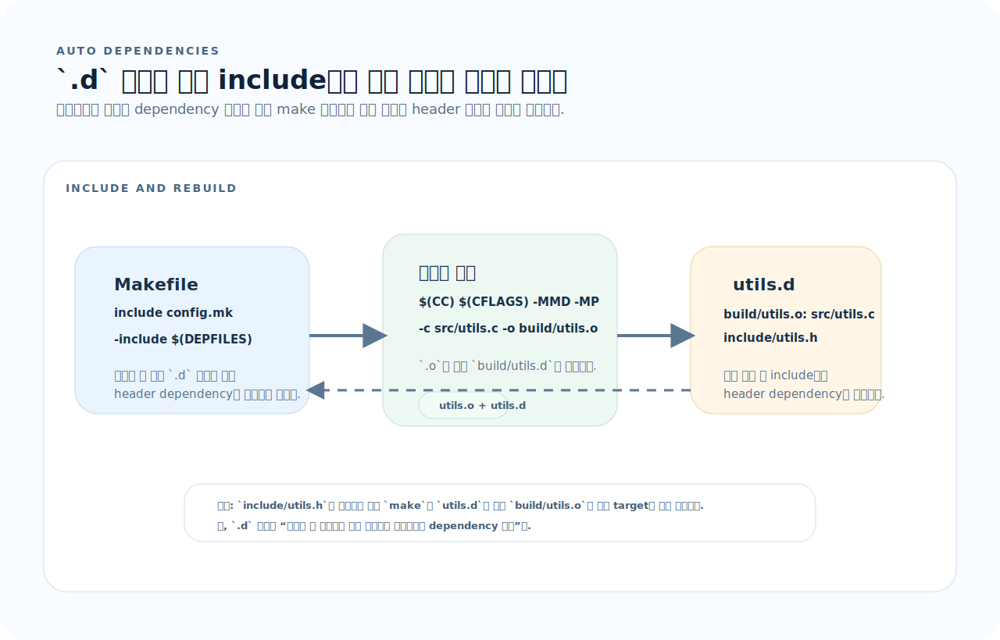

# Makefile 완전 가이드

Make는 문법보다 "어떤 파일이 어떤 파일에 의존하고, 어떤 규칙이 언제 확정되는가"를 먼저 잡아야 읽힌다. 이 문서는 dependency graph, 변수 평가 시점, 패턴 규칙, 자동 의존성 흐름을 중심으로 Makefile을 정리한다.

## 목차
1. [기본 개념 — Target, Dependency, Recipe](#1-기본-개념--target-dependency-recipe)
2. [변수](#2-변수)
3. [자동 변수와 패턴 규칙](#3-자동-변수와-패턴-규칙)
4. [.PHONY와 특수 타깃](#4-phony와-특수-타깃)
5. [함수](#5-함수)
6. [조건문](#6-조건문)
7. [다중 타깃과 재귀 Make](#7-다중-타깃과-재귀-make)
8. [C/C++ 프로젝트 빌드](#8-cc-프로젝트-빌드)
9. [유틸리티 Makefile — 비 C 프로젝트](#9-유틸리티-makefile--비-c-프로젝트)
10. [자주 하는 실수](#10-자주-하는-실수)
11. [빠른 참조](#11-빠른-참조)

---

## 1. 기본 개념 — Target, Dependency, Recipe

Make는 명령을 순서대로 실행하는 도구라기보다, 파일 간 의존성 그래프를 따라 "오래된 것만 다시 만드는" 도구다.



- target은 "만들 결과물"이고 dependency는 "이 결과물이 의존하는 파일"이다.
- Make는 dependency의 수정 시간이 target보다 새로우면 그 target의 recipe를 다시 실행한다.
- 따라서 순서를 외우기보다 어떤 화살표가 어떤 산출물로 이어지는지 먼저 보면 된다.

### 구조

```makefile
target: dependencies
	recipe    # ← 반드시 탭(Tab)으로 시작. 스페이스 불가.
```

```makefile
app: main.o utils.o
	gcc -o app main.o utils.o

main.o: main.c
	gcc -c main.c

utils.o: utils.c utils.h
	gcc -c utils.c

clean:
	rm -f app *.o
```

### 실행 흐름

```bash
make app
# 1. app이 main.o, utils.o에 의존
# 2. main.o가 main.c에 의존 → main.c가 main.o보다 새로우면 재컴파일
# 3. utils.o도 마찬가지
# 4. main.o 또는 utils.o가 갱신되면 app 재링크
```

### 기본 타깃

```makefile
# 첫 번째 타깃이 기본 타깃
all: app tests

# make 만 실행하면 all이 실행됨
```

### 의존성 그래프

```
all → app → main.o → main.c
              ↘ utils.o → utils.c
                          → utils.h
    → tests → test_app → ...
```

Make는 파일의 수정 시간을 비교해서 필요한 것만 다시 빌드한다.

---

## 2. 변수

Make 변수는 값 자체보다 "언제 평가되는가"가 더 중요하다. `=`와 `:=` 차이를 놓치면 같은 Makefile도 전혀 다르게 동작한다.



- `=`는 나중에 참조할 때 펼쳐지는 지연 평가다.
- `:=`는 선언 순간의 값을 고정하는 즉시 평가다.
- 외부에서 `make CC=clang`처럼 넘긴 값은 Makefile 기본값보다 우선한다.

### 변수 할당

```makefile
# = 재귀적 확장 (사용 시점에 평가)
CC = gcc

# := 즉시 확장 (할당 시점에 평가)
CFLAGS := -Wall -Wextra -O2

# ?= 기본값 (정의되지 않은 경우만 설정)
CC ?= gcc

# += 추가
CFLAGS += -std=c17
```

### 변수 사용

```makefile
CC = gcc
CFLAGS = -Wall -Wextra -O2
LDFLAGS = -lm

app: main.o
	$(CC) $(CFLAGS) -o $@ $^ $(LDFLAGS)
```

### `=` vs `:=`

```makefile
# = 재귀적 — 사용 시 평가
A = $(B)
B = hello
# $(A)는 "hello" → B가 나중에 바뀌면 A도 바뀜

# := 즉시 — 할당 시 평가
A := $(B)
B = hello
# $(A)는 "" → 할당 시점에 B가 아직 없음
```

### 외부에서 변수 전달

```bash
make CC=clang CFLAGS="-O3"              # 명령줄에서 덮어쓰기
CC=clang make                           # 환경 변수로 전달
```

```makefile
# 우선순위: make 명령줄 > Makefile 내 = > 환경 변수 > ?=
```

---

## 3. 자동 변수와 패턴 규칙

패턴 규칙은 "하나의 템플릿으로 여러 파일 규칙을 만든다"는 사고방식으로 보면 이해가 빨라진다.



- `%.o: %.c`는 모든 `.c -> .o` 변환 규칙의 템플릿이다.
- `$@`, `$<`, `$^`는 템플릿이 실제 파일 이름으로 펼쳐진 뒤에 채워진다.
- 같은 규칙을 여러 파일에 복붙하지 않고 stem만 바꿔 재사용하는 것이 패턴 규칙의 핵심이다.

### 자동 변수

```makefile
app: main.o utils.o
	$(CC) -o $@ $^

# $@  = 타깃 이름          (app)
# $<  = 첫 번째 의존성      (main.o)
# $^  = 모든 의존성          (main.o utils.o)
# $?  = 타깃보다 새로운 의존성
# $*  = 패턴 매칭의 stem     (% 부분)
# $(@D) = 타깃의 디렉터리 부분
# $(@F) = 타깃의 파일 부분
```

### 패턴 규칙

```makefile
# %.o: %.c — 모든 .c 파일을 .o로 컴파일하는 규칙
%.o: %.c
	$(CC) $(CFLAGS) -c $< -o $@

# 사용 예
SRCS = main.c utils.c core.c
OBJS = $(SRCS:.c=.o)        # main.o utils.o core.o

app: $(OBJS)
	$(CC) -o $@ $^ $(LDFLAGS)
```

### 정적 패턴 규칙

```makefile
OBJS = main.o utils.o core.o

# 특정 파일에만 적용되는 패턴
$(OBJS): %.o: %.c
	$(CC) $(CFLAGS) -c $< -o $@
```

---

## 4. .PHONY와 특수 타깃

### .PHONY

```makefile
.PHONY: all clean test install help

# .PHONY 이유:
# "clean"이라는 파일이 존재하면 make clean이 "이미 최신"으로 판단
# .PHONY로 선언하면 파일 존재 여부와 무관하게 항상 실행
```

### 주요 특수 타깃

```makefile
# .DEFAULT_GOAL — 기본 타깃 지정
.DEFAULT_GOAL := all

# .SILENT — 명령 출력 숨기기
.SILENT: clean

# .DELETE_ON_ERROR — 실패 시 타깃 파일 삭제
.DELETE_ON_ERROR:

# .SUFFIXES — 접미사 규칙 (레거시)
.SUFFIXES:            # 기본 접미사 규칙 제거
.SUFFIXES: .c .o      # 사용할 접미사만 지정
```

### 레시피 접두사

```makefile
test:
	@echo "테스트 시작"      # @ — 명령 자체를 출력하지 않음
	-rm -f temp.txt         # - — 실패해도 계속 진행
	+$(MAKE) subtarget      # + — make -n 에서도 실행
```

---

## 5. 함수

### 텍스트 함수

```makefile
SRCS = src/main.c src/utils.c src/core.c

# 치환
OBJS = $(patsubst src/%.c, build/%.o, $(SRCS))
# build/main.o build/utils.o build/core.o

# 간단한 치환 (접미사만)
OBJS = $(SRCS:.c=.o)
# src/main.o src/utils.o src/core.o

# 필터
C_SRCS = $(filter %.c, $(SRCS))       # .c만
NOT_MAIN = $(filter-out %main.c, $(SRCS))  # main.c 제외

# 단어
FIRST = $(firstword $(SRCS))
COUNT = $(words $(SRCS))

# 정렬 + 중복 제거
SORTED = $(sort z a m a b)    # a b m z
```

### 파일 함수

```makefile
SRCS = src/main.c lib/utils.c

DIRS = $(dir $(SRCS))          # src/ lib/
FILES = $(notdir $(SRCS))      # main.c utils.c
BASES = $(basename $(SRCS))    # src/main lib/utils
EXTS = $(suffix $(SRCS))       # .c .c
ABS = $(abspath $(SRCS))       # 절대 경로

# 와일드카드 (주의: 런타임에 파일 시스템 검색)
SRCS = $(wildcard src/*.c)
```

### 셸 함수

```makefile
GIT_HASH = $(shell git rev-parse --short HEAD)
DATE = $(shell date +%Y-%m-%d)

CFLAGS += -DGIT_HASH=\"$(GIT_HASH)\"
```

### foreach / call

```makefile
DIRS = src lib tests

# foreach
clean-all:
	$(foreach dir,$(DIRS),$(MAKE) -C $(dir) clean;)

# define + call
define compile_template
$(1)/%.o: $(1)/%.c
	$(CC) $(CFLAGS) -c $$< -o $$@
endef

$(foreach dir,$(DIRS),$(eval $(call compile_template,$(dir))))
```

---

## 6. 조건문

```makefile
# ifeq / ifneq
ifeq ($(CC), gcc)
  CFLAGS += -Wno-unused-parameter
endif

ifneq ($(DEBUG),)
  CFLAGS += -g -DDEBUG
else
  CFLAGS += -O2 -DNDEBUG
endif

# ifdef / ifndef
ifdef VERBOSE
  Q =
else
  Q = @
endif

app: main.o
	$(Q)$(CC) -o $@ $^

# OS 감지
UNAME := $(shell uname -s)
ifeq ($(UNAME), Linux)
  LDFLAGS += -lpthread
endif
ifeq ($(UNAME), Darwin)
  LDFLAGS += -framework CoreFoundation
endif
```

---

## 7. 다중 타깃과 재귀 Make

실전 Makefile에서 자주 놓치는 지점은 헤더 의존성이 자동으로 다시 들어오는 흐름이다. `include`와 `.d` 파일 생성 규칙을 함께 봐야 한다.



- 첫 실행에서는 `.c`를 컴파일하면서 `.o`와 `.d`를 함께 만든다.
- 다음 실행부터는 `-include $(DEPFILES)`가 `.d`를 읽어 header dependency를 그래프에 다시 붙인다.
- 그래서 `utils.h`만 바뀌어도 관련 `.o`가 정확히 다시 빌드된다.

### 서브디렉터리 빌드

```makefile
SUBDIRS = src lib tests

.PHONY: all clean $(SUBDIRS)

all: $(SUBDIRS)

$(SUBDIRS):
	$(MAKE) -C $@

# 순서 지정
lib:
src: lib          # src 빌드 전에 lib 먼저
tests: src lib

clean:
	$(foreach dir,$(SUBDIRS),$(MAKE) -C $(dir) clean;)
```

### include

```makefile
# 다른 Makefile 포함
include config.mk
-include local.mk           # 없어도 에러 안 남

# 자동 의존성 (.d 파일)
DEPFILES = $(OBJS:.o=.d)
-include $(DEPFILES)

# .d 파일 생성 규칙
%.o: %.c
	$(CC) $(CFLAGS) -MMD -MP -c $< -o $@
```

---

## 8. C/C++ 프로젝트 빌드

### 완전한 예제

```makefile
# 프로젝트 설정
CC       = gcc
CFLAGS   = -Wall -Wextra -std=c17
LDFLAGS  =
LDLIBS   = -lm

# 디렉터리
SRC_DIR  = src
INC_DIR  = include
BUILD_DIR = build

# 소스와 오브젝트
SRCS     = $(wildcard $(SRC_DIR)/*.c)
OBJS     = $(patsubst $(SRC_DIR)/%.c, $(BUILD_DIR)/%.o, $(SRCS))
DEPS     = $(OBJS:.o=.d)
TARGET   = $(BUILD_DIR)/app

# 빌드 타입
ifdef DEBUG
  CFLAGS += -g -O0 -DDEBUG
else
  CFLAGS += -O2 -DNDEBUG
endif

.PHONY: all clean test

all: $(TARGET)

$(TARGET): $(OBJS)
	@mkdir -p $(@D)
	$(CC) $(LDFLAGS) -o $@ $^ $(LDLIBS)

$(BUILD_DIR)/%.o: $(SRC_DIR)/%.c
	@mkdir -p $(@D)
	$(CC) $(CFLAGS) -I$(INC_DIR) -MMD -MP -c $< -o $@

# 자동 의존성 포함
-include $(DEPS)

test: $(TARGET)
	./$(TARGET) --test

clean:
	rm -rf $(BUILD_DIR)
```

```bash
make                     # Release 빌드
make DEBUG=1             # Debug 빌드
make clean && make       # 클린 빌드
make -j$(nproc)          # 병렬 빌드
make -n                  # dry run (명령만 출력)
```

---

## 9. 유틸리티 Makefile — 비 C 프로젝트

### Python/Node.js 프로젝트용

```makefile
.PHONY: help install dev test lint format clean docker

help:  ## 도움말 출력
	@grep -E '^[a-zA-Z_-]+:.*?## .*$$' $(MAKEFILE_LIST) | \
		awk 'BEGIN {FS = ":.*?## "}; {printf "  %-15s %s\n", $$1, $$2}'

install:  ## 의존성 설치
	pip install -r requirements.txt

dev:  ## 개발 서버 실행
	uvicorn app.main:app --reload --port 8000

test:  ## 테스트 실행
	pytest -v --cov=app tests/

lint:  ## 린트
	ruff check .
	mypy app/

format:  ## 포맷팅
	ruff format .

clean:  ## 캐시 정리
	find . -type d -name __pycache__ -exec rm -rf {} +
	rm -rf .pytest_cache .mypy_cache .ruff_cache htmlcov

# Docker
IMAGE = myapp
TAG = $(shell git rev-parse --short HEAD)

docker:  ## Docker 이미지 빌드
	docker build -t $(IMAGE):$(TAG) -t $(IMAGE):latest .

docker-run:  ## Docker 실행
	docker run --rm -p 8000:8000 $(IMAGE):latest
```

### help 타깃 패턴

```bash
make help
#   install         의존성 설치
#   dev             개발 서버 실행
#   test            테스트 실행
#   lint            린트
#   format          포맷팅
#   clean           캐시 정리
#   docker          Docker 이미지 빌드
```

`## 주석`을 타깃 옆에 놓으면 `help`에서 자동으로 추출된다.

---

## 10. 자주 하는 실수

| 실수 | 원인 | 해결 |
|------|------|------|
| 레시피를 스페이스로 들여씀 | Make는 탭만 인식 | 반드시 탭(Tab) 사용 |
| `.PHONY` 미선언 | 동명 파일이 있으면 실행 안 됨 | 파일 없는 타깃은 `.PHONY` 등록 |
| `=` vs `:=` 착각 | 재귀 확장으로 예상 밖 결과 | 대부분 `:=` 권장, 지연 평가 필요 시만 `=` |
| `$` 변수를 셸과 혼동 | Make 변수 `$(VAR)`, 셸 변수 `$$VAR` | 셸 변수는 `$$` 사용 |
| `wildcard` 의존 | 새 파일이 감지 안 될 수 있음 | 소스 파일 명시적 나열 권장 |
| 멀티라인 셸 명령 | 각 줄이 별도 셸에서 실행 | `\`로 이어쓰기, 또는 `.ONESHELL:` |
| 병렬 빌드 실패 | 의존성 누락 | `-j1`로 확인 후 의존성 보강 |
| `make -C` 경로 오류 | 상대 경로 기준 혼동 | `$(MAKE) -C` 사용, 경로 확인 |

---

## 11. 빠른 참조

```makefile
# 기본 구조
target: dependencies
	recipe (탭으로 시작)

# 변수
VAR = value          # 재귀적 확장
VAR := value         # 즉시 확장
VAR ?= default       # 기본값
VAR += more          # 추가

# 자동 변수
# $@  타깃    $<  첫 번째 의존성    $^  모든 의존성
# $?  새로운 의존성    $*  패턴 stem

# 패턴 규칙
%.o: %.c
	$(CC) $(CFLAGS) -c $< -o $@

# .PHONY
.PHONY: all clean test

# 함수
$(patsubst %.c, %.o, $(SRCS))    # 패턴 치환
$(wildcard src/*.c)              # 파일 검색
$(shell cmd)                     # 셸 실행
$(filter %.c, $(FILES))          # 필터
$(foreach var, list, body)       # 반복

# 조건
ifeq ($(VAR), value) ... else ... endif
ifdef VAR ... endif

# 레시피 접두사
@cmd          # 명령 숨기기
-cmd          # 실패 무시

# 서브디렉터리
$(MAKE) -C subdir target

# 실행
# make                 기본 타깃
# make target          특정 타깃
# make -j$(nproc)      병렬 빌드
# make -n              dry run
# make VAR=value       변수 전달
# make -C dir          디렉터리 이동
```
