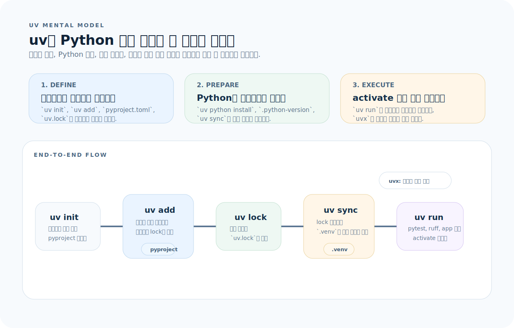
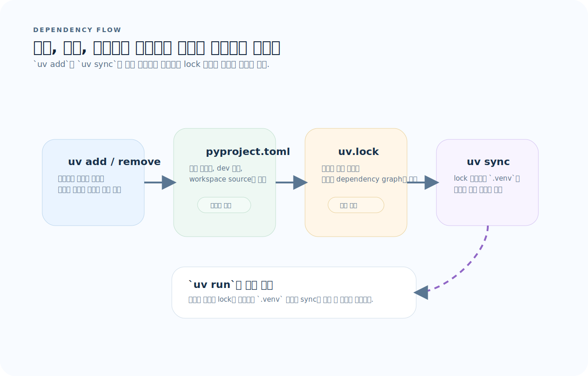
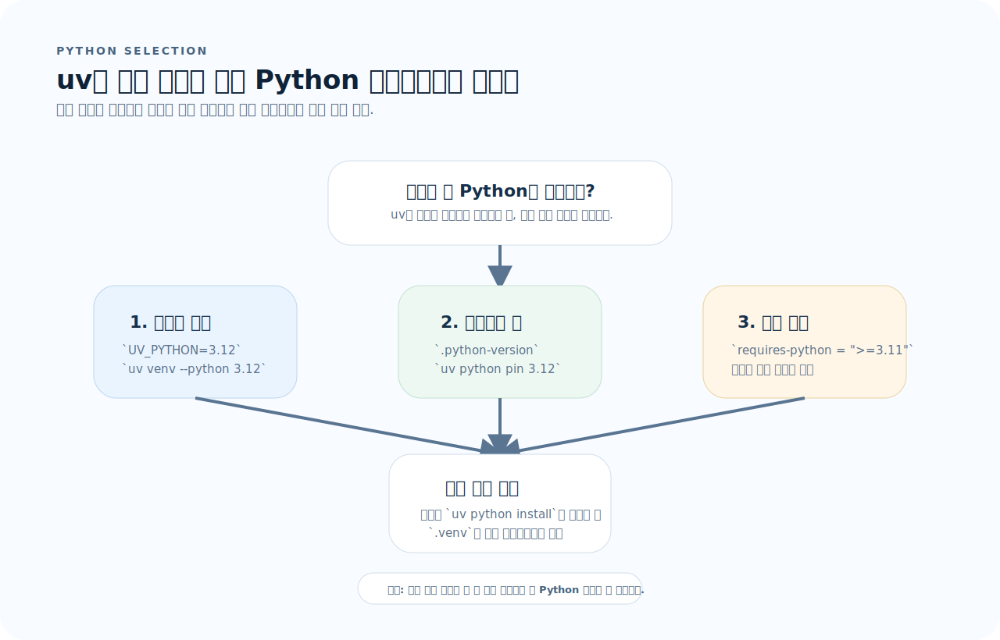
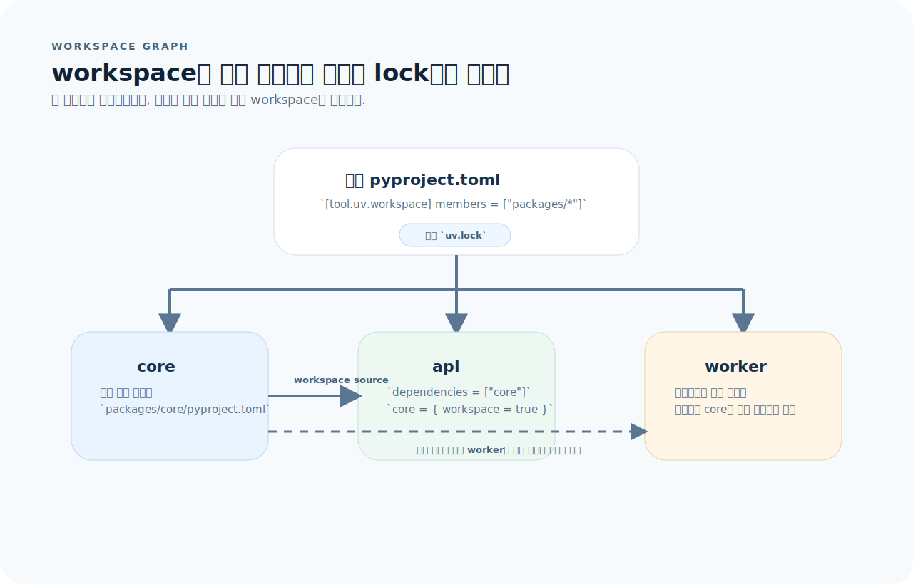

# uv 완전 가이드

uv는 명령이 많아 보여도 실제로는 "프로젝트 정의, 의존성 잠금, 환경 동기화, 실행"을 하나의 흐름으로 묶는 도구다. 이 문서는 uv를 Python 패키지 관리자 목록이 아니라 워크플로 엔진으로 이해하도록 재구성한다.

## 목차
1. [uv란](#1-uv란)
2. [설치](#2-설치)
3. [프로젝트 생성과 초기화](#3-프로젝트-생성과-초기화)
4. [의존성 관리 — add, remove, sync](#4-의존성-관리--add-remove-sync)
5. [uv run — 프로젝트 환경에서 실행](#5-uv-run--프로젝트-환경에서-실행)
6. [Python 버전 관리](#6-python-버전-관리)
7. [pyproject.toml 구조](#7-pyprojecttoml-구조)
8. [Lock 파일과 재현성](#8-lock-파일과-재현성)
9. [스크립트와 도구 실행 — uvx](#9-스크립트와-도구-실행--uvx)
10. [워크스페이스](#10-워크스페이스)
11. [pip 호환 인터페이스](#11-pip-호환-인터페이스)
12. [자주 하는 실수](#12-자주-하는-실수)
13. [빠른 참조](#13-빠른-참조)

---

## 1. uv란

uv를 빨리 익히려면 pip 대체재 하나로 보지 말고, Python 개발 루프 전체를 묶는 진입점으로 이해하는 편이 좋다.



이 그림을 기준으로 먼저 세 가지를 보면 된다.

1. **정의:** 프로젝트와 의존성은 `pyproject.toml`과 `uv.lock`에 어디까지 고정되는가?
2. **환경:** Python 버전과 가상환경은 언제 자동으로 준비되는가?
3. **실행:** `uv run`, `uvx`, `uv python`이 각각 어떤 문제를 해결하는가?

uv는 Rust로 작성된 Python 패키지 및 프로젝트 관리 도구다. pip, pip-tools, pipx, poetry, pyenv, virtualenv를 하나로 통합한다.

### 기존 도구와 비교

| 기능 | 기존 도구 | uv |
|------|----------|-----|
| 패키지 설치 | pip | `uv pip install` |
| 의존성 잠금 | pip-tools, poetry | `uv lock` |
| 가상환경 | venv, virtualenv | `uv venv` |
| Python 버전 | pyenv | `uv python install` |
| 프로젝트 관리 | poetry, pdm | `uv init`, `uv add` |
| 도구 실행 | pipx | `uvx` |
| 속도 | 느림 | **10-100x 빠름** |

---

## 2. 설치

```bash
# macOS / Linux
curl -LsSf https://astral.sh/uv/install.sh | sh

# Homebrew
brew install uv

# pip
pip install uv

# 업데이트
uv self update
```

---

## 3. 프로젝트 생성과 초기화

### 새 프로젝트

```bash
# 애플리케이션 (기본)
uv init myproject
cd myproject

# 라이브러리
uv init --lib mylib

# 기존 디렉터리에서 초기화
cd existing-project
uv init
```

### 생성되는 파일

```
myproject/
├── pyproject.toml       # 프로젝트 설정 + 의존성
├── uv.lock              # 잠금 파일 (자동 생성)
├── .python-version      # Python 버전 핀
├── README.md
└── src/
    └── myproject/
        └── __init__.py
```

---

## 4. 의존성 관리 — add, remove, sync

uv의 의존성 관리는 "설정 파일 편집"이 아니라 `pyproject.toml -> uv.lock -> .venv`를 일관되게 맞추는 파이프라인으로 보는 편이 정확하다.



- `uv add`와 `uv remove`는 프로젝트 선언과 lock 정보를 함께 갱신한다.
- `uv sync`는 lock 파일을 기준으로 `.venv`를 실제 상태로 맞춘다.
- `uv run`은 환경이 비어 있으면 생성과 sync까지 이어서 처리한다.

### 의존성 추가

```bash
# 프로덕션 의존성
uv add fastapi
uv add "sqlalchemy>=2.0"
uv add "pydantic[email]"        # extras 포함
uv add fastapi uvicorn sqlalchemy  # 여러 개 한 번에

# 개발 의존성 (--dev)
uv add --dev pytest ruff mypy
uv add --dev pytest-cov pytest-asyncio

# 그룹별 의존성
uv add --group lint ruff
uv add --group test pytest

# 로컬 패키지
uv add ./packages/mylib

# Git 의존성
uv add "mylib @ git+https://github.com/user/mylib.git"
uv add "mylib @ git+https://github.com/user/mylib.git@v1.0"
```

### 의존성 제거

```bash
uv remove fastapi
uv remove --dev pytest
```

### sync — 환경 동기화

```bash
# 의존성 설치 (lock 파일 기준)
uv sync

# 개발 의존성 포함
uv sync --dev

# 특정 그룹 포함
uv sync --group test --group lint

# 모든 extras 포함
uv sync --all-extras

# 프로덕션만 (dev 제외)
uv sync --no-dev

# 의존성 트리 확인
uv tree
```

---

## 5. uv run — 프로젝트 환경에서 실행

### 기본 사용

```bash
# 프로젝트 환경에서 Python 실행
uv run python main.py
uv run python -m myproject.cli

# 프로젝트 환경에서 도구 실행
uv run pytest
uv run pytest -v tests/
uv run ruff check .
uv run mypy src/

# 모듈 실행
uv run python -c "import myproject; print(myproject.__version__)"
```

### activate 없이 작업

```bash
# 기존 방식 (불필요)
source .venv/bin/activate
pytest
deactivate

# uv 방식
uv run pytest      # activate 없이 바로 실행
```

`uv run`은 자동으로:
1. 가상환경이 없으면 생성
2. `uv.lock` 기준으로 의존성 동기화
3. 가상환경 안에서 명령 실행

### 환경 변수

```bash
UV_PYTHON=3.12 uv run pytest     # Python 버전 지정
uv run --env-file .env python app.py  # .env 파일 로드
```

---

## 6. Python 버전 관리

uv의 Python 버전 선택은 단순 설치가 아니라 "어떤 기준으로 인터프리터를 고르는가"의 문제다. 우선순위를 이해하면 프로젝트마다 Python이 달라져도 덜 흔들린다.



- `UV_PYTHON` 같은 명시적 지정이 있으면 가장 먼저 우선한다.
- 프로젝트 안에서는 `.python-version` 핀과 `requires-python` 범위가 함께 기준이 된다.
- 필요한 버전이 없으면 `uv python install`로 설치한 뒤 `.venv`가 그 인터프리터를 사용한다.

### 설치

```bash
# Python 버전 설치
uv python install 3.12
uv python install 3.11 3.12 3.13

# 설치된 버전 확인
uv python list

# 사용 가능한 버전 확인
uv python list --all-versions
```

### 버전 고정

```bash
# .python-version 파일 생성
uv python pin 3.12

# 프로젝트별 Python 버전
cat .python-version
# 3.12
```

### pyproject.toml에서 요구 버전

```toml
[project]
requires-python = ">=3.11"
```

---

## 7. pyproject.toml 구조

```toml
[project]
name = "myproject"
version = "0.1.0"
description = "My project description"
readme = "README.md"
requires-python = ">=3.11"
license = { text = "MIT" }
authors = [
    { name = "Name", email = "email@example.com" }
]

# 프로덕션 의존성
dependencies = [
    "fastapi>=0.110",
    "sqlalchemy>=2.0",
    "pydantic>=2.0",
    "uvicorn[standard]>=0.29",
]

# 선택적 의존성 (extras)
[project.optional-dependencies]
email = ["aiosmtplib>=3.0"]

# 스크립트 (CLI 엔트리포인트)
[project.scripts]
myapp = "myproject.cli:main"

# 빌드 시스템
[build-system]
requires = ["hatchling"]
build-backend = "hatchling.build"

# uv 전용 설정
[tool.uv]
dev-dependencies = [
    "pytest>=8.0",
    "pytest-asyncio>=0.23",
    "ruff>=0.4",
    "mypy>=1.10",
]

[tool.uv.sources]
# 개발 중 로컬 패키지 참조
mylib = { path = "../mylib", editable = true }
```

---

## 8. Lock 파일과 재현성

### uv.lock

```bash
# lock 파일 생성/갱신
uv lock

# 업그레이드 허용
uv lock --upgrade

# 특정 패키지만 업그레이드
uv lock --upgrade-package fastapi

# lock 파일 확인 (변경 없이)
uv lock --check
```

### 재현 가능한 환경

```bash
# CI에서 — lock 파일 기준으로 정확히 설치
uv sync --frozen          # lock 파일 갱신 없이 설치
uv sync --no-dev --frozen # 프로덕션만

# lock 파일이 pyproject.toml과 맞지 않으면 에러
```

### .gitignore

```gitignore
# uv 관련
.venv/

# uv.lock은 커밋한다 (재현성 보장)
# !uv.lock
```

`uv.lock`은 반드시 버전 관리에 포함한다. pip의 `requirements.txt`와 같은 역할이지만 더 정확하다.

---

## 9. 스크립트와 도구 실행 — uvx

### uvx — 일회성 도구 실행

```bash
# 설치 없이 도구 실행
uvx ruff check .
uvx black .
uvx isort .
uvx mypy src/

# 특정 버전
uvx ruff@0.4.0 check .

# 추가 패키지 포함
uvx --with numpy ipython
```

### 인라인 스크립트 의존성

```python
# /// script
# requires-python = ">=3.11"
# dependencies = [
#     "requests",
#     "rich",
# ]
# ///

import requests
from rich import print

resp = requests.get("https://api.example.com/data")
print(resp.json())
```

```bash
# 의존성이 자동으로 설치되고 실행
uv run script.py
```

---

## 10. 워크스페이스

워크스페이스에서는 패키지가 여러 개여도 lock 파일과 해석 기준은 하나로 묶인다. 그래서 개별 패키지가 아니라 루트와 내부 의존성 그래프를 먼저 봐야 한다.



- 루트 `pyproject.toml`이 workspace member 목록을 선언한다.
- 각 패키지는 독립적인 `pyproject.toml`을 가지지만, lock은 루트 `uv.lock` 하나로 통합된다.
- `core = { workspace = true }` 같은 선언으로 내부 패키지를 로컬 소스로 연결한다.

### 모노레포 구조

```toml
# 루트 pyproject.toml
[tool.uv.workspace]
members = [
    "packages/*",
]
```

```
monorepo/
├── pyproject.toml          # 워크스페이스 루트
├── uv.lock                 # 통합 lock
├── packages/
│   ├── core/
│   │   ├── pyproject.toml
│   │   └── src/core/
│   ├── api/
│   │   ├── pyproject.toml
│   │   └── src/api/
│   └── worker/
│       ├── pyproject.toml
│       └── src/worker/
```

```toml
# packages/api/pyproject.toml
[project]
name = "api"
dependencies = ["core"]  # 워크스페이스 내 패키지 참조

[tool.uv.sources]
core = { workspace = true }
```

---

## 11. pip 호환 인터페이스

```bash
# pip처럼 사용 (레거시 프로젝트 호환)
uv pip install flask
uv pip install -r requirements.txt
uv pip install -e .

# requirements.txt 생성
uv pip compile pyproject.toml -o requirements.txt
uv pip compile requirements.in -o requirements.txt

# 가상환경 생성
uv venv
uv venv --python 3.12
uv venv .venv

# freeze
uv pip freeze

# 패키지 목록
uv pip list
```

---

## 12. 자주 하는 실수

| 실수 | 원인 | 해결 |
|------|------|------|
| `uv sync` 없이 코드 실행 | 의존성 미설치 상태 | 코드 실행 전 `uv sync` |
| `uv run` 대신 전역 Python 사용 | 환경 불일치 | 항상 `uv run` 으로 감싸서 실행 |
| 시스템 Python과 프로젝트 Python 혼용 | 버전 충돌 | `.python-version` 핀 + `uv python pin` |
| `pyproject.toml` 수동 편집 후 sync 누락 | lock과 환경이 불일치 | `uv lock && uv sync` |
| `uv.lock`을 `.gitignore`에 추가 | 재현성 없는 빌드 | `uv.lock`은 반드시 커밋 |
| `pip install` 직접 사용 | uv 환경과 충돌 | `uv add` 또는 `uv pip install` 사용 |
| 가상환경 activate 후 혼란 | activate 상태 관리 부담 | `uv run` 중심으로 전환 |
| `--dev` 빼먹고 테스트 실패 | 테스트 도구 미설치 | `uv sync --dev` |

---

## 13. 빠른 참조

```bash
# 프로젝트 초기화
uv init myproject              # 새 프로젝트
uv init --lib mylib            # 라이브러리

# 의존성
uv add fastapi                 # 추가
uv add --dev pytest ruff       # 개발 의존성
uv remove fastapi              # 제거
uv sync                        # 환경 동기화
uv sync --dev                  # 개발 의존성 포함
uv sync --frozen               # lock 기준 정확 설치
uv lock                        # lock 갱신
uv lock --upgrade              # 전체 업그레이드
uv tree                        # 의존성 트리

# 실행
uv run python main.py          # 프로젝트 환경 실행
uv run pytest -v               # 테스트
uv run ruff check .            # 린트

# Python 버전
uv python install 3.12         # 설치
uv python pin 3.12             # 핀
uv python list                 # 목록

# 도구
uvx ruff check .               # 일회성 실행
uvx --with numpy ipython       # 추가 패키지

# pip 호환
uv pip install -r requirements.txt
uv pip compile pyproject.toml -o requirements.txt
uv venv --python 3.12
```
