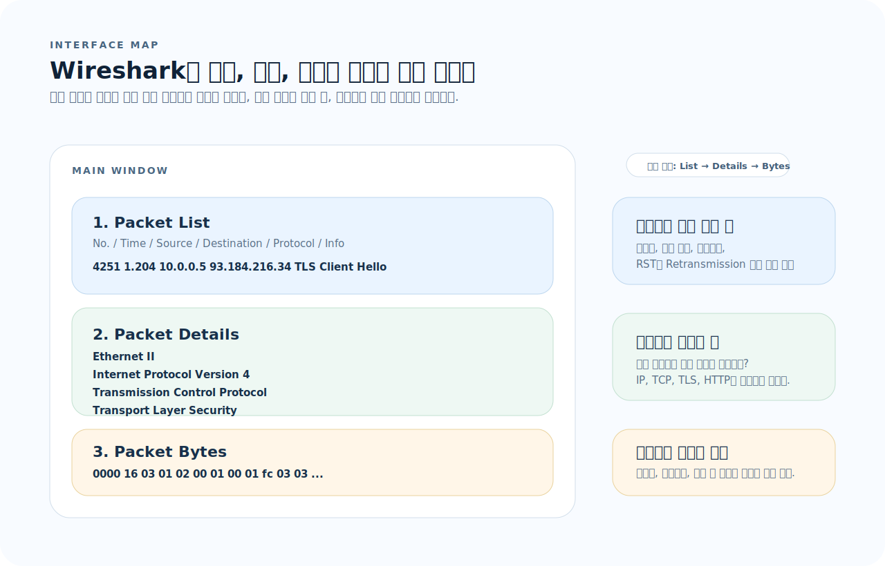
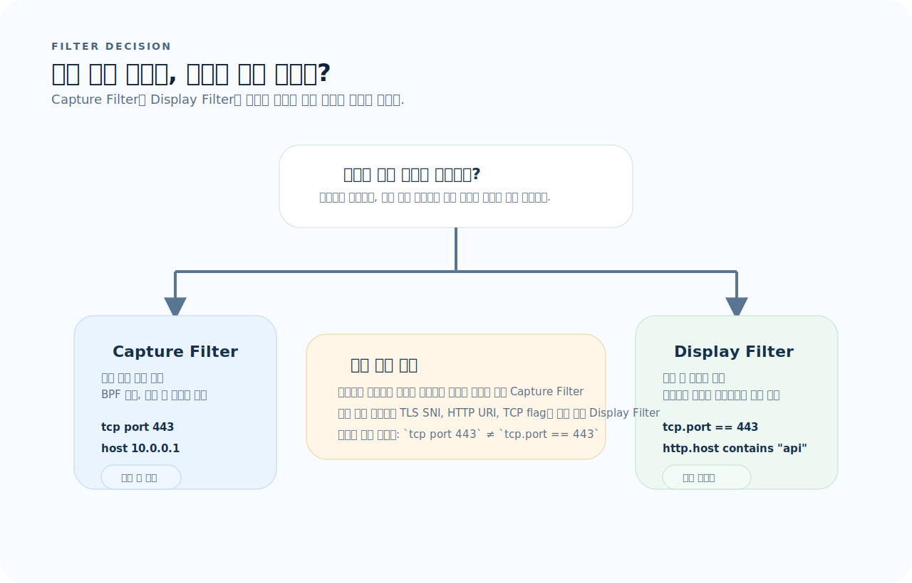
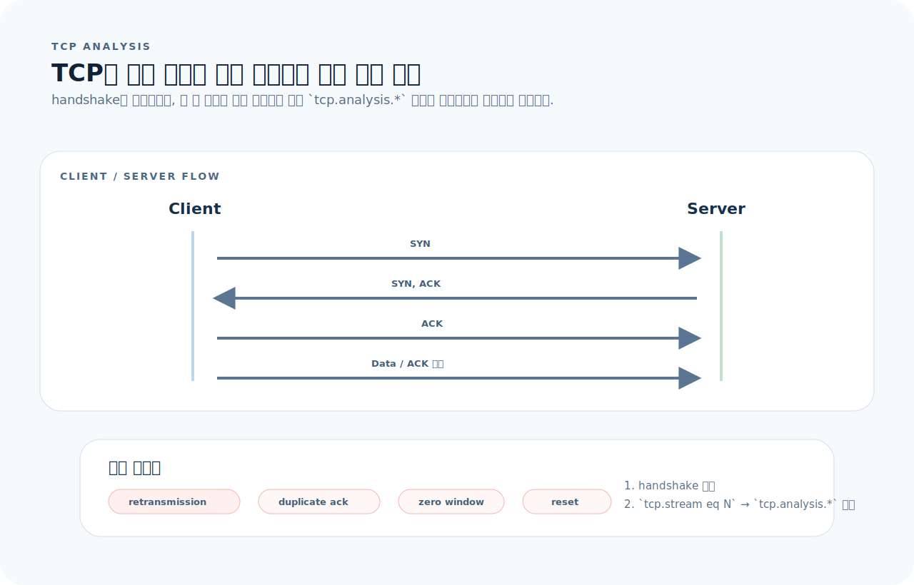
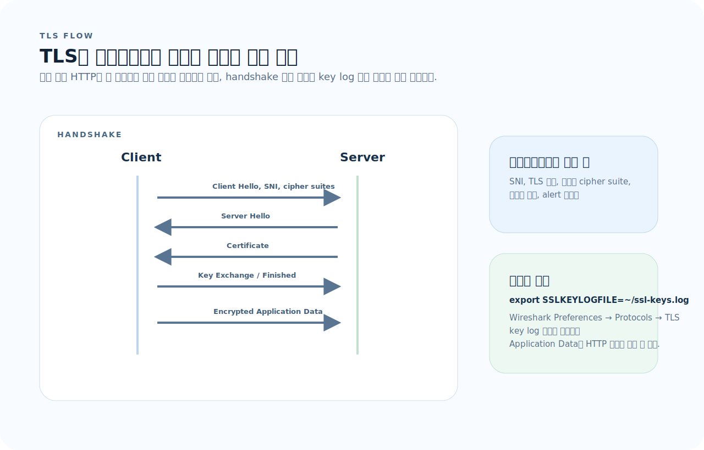

# Wireshark 완전 가이드

Wireshark는 필터 문법보다 "패킷을 어떤 순서로 좁혀 읽을 것인가"를 먼저 잡아야 실전에 바로 쓸 수 있다. 이 문서는 화면 구조, 필터 선택, TCP 흐름, TLS 해석을 중심으로 패킷 분석 기준을 세운다.

## 목차
1. [기본 개념](#1-기본-개념)
2. [인터페이스 구성](#2-인터페이스-구성)
3. [Capture Filter — 캡처 전 필터링](#3-capture-filter--캡처-전-필터링)
4. [Display Filter — 캡처 후 필터링](#4-display-filter--캡처-후-필터링)
5. [프로토콜 계층별 분석](#5-프로토콜-계층별-분석)
6. [TCP 분석](#6-tcp-분석)
7. [DNS 분석](#7-dns-분석)
8. [HTTP 분석](#8-http-분석)
9. [TLS 분석](#9-tls-분석)
10. [흐름 추적과 통계](#10-흐름-추적과-통계)
11. [tshark — CLI 분석](#11-tshark--cli-분석)
12. [자주 하는 실수](#12-자주-하는-실수)
13. [빠른 참조](#13-빠른-참조)

---

## 1. 기본 개념

Wireshark를 처음 볼 때는 수많은 패킷과 프로토콜 이름 때문에 복잡해 보이지만, 실제 분석은 몇 가지 질문으로 좁혀진다.

1. **위치:** 지금 보는 문제가 캡처 범위 문제인가, 이미 잡힌 패킷을 어떻게 좁혀 볼지의 문제인가?
2. **계층:** Ethernet, IP, TCP, HTTP/TLS 중 어느 계층에서 이상이 처음 보이는가?
3. **흐름:** 단일 패킷이 아니라 연결 전체 흐름으로 보면 어떤 순서에서 끊기거나 지연되는가?

### 패킷 캡처란

네트워크 인터페이스를 통과하는 패킷을 가로채어 저장·분석하는 것이다. Wireshark는 GUI, tshark는 CLI 도구다.

### 프로토콜 스택

```
Application    HTTP, DNS, TLS, DHCP, FTP, SMTP
Transport      TCP, UDP
Network        IP, ICMP, ARP
Data Link      Ethernet, Wi-Fi (802.11)
Physical       전기/광 신호
```

각 계층은 하위 계층을 캡슐화한다. 패킷 분석은 아래에서 위로 올라가며 읽는다.

### 파일 형식

| 형식 | 설명 |
|------|------|
| `.pcapng` | Wireshark 기본 (메타데이터 풍부) |
| `.pcap` | 레거시 (호환성 높음) |

---

## 2. 인터페이스 구성

### 메인 화면 3영역

Wireshark 화면은 "목록에서 고르고, 계층을 펼치고, 바이트를 확인한다"는 세 단계로 읽으면 된다.



- `Packet List`는 이상 패턴을 찾는 입구다. 시간, 주소, 프로토콜, Info를 먼저 본다.
- `Packet Details`는 어떤 계층에서 문제가 시작되는지 확인하는 곳이다.
- `Packet Bytes`는 실제 페이로드와 오프셋을 대조해야 할 때만 내려간다.

### 색상 규칙

| 색상 | 의미 |
|------|------|
| 연두 | HTTP |
| 연파랑 | UDP |
| 보라 | TCP |
| 검정(빨강 텍스트) | TCP 오류 (재전송, RST 등) |
| 노랑 | 경고 (checksum 오류 등) |

---

## 3. Capture Filter — 캡처 전 필터링

필터에서 가장 흔한 실수는 "캡처 범위를 줄이는 문제"와 "이미 캡처한 패킷을 다시 고르는 문제"를 섞는 것이다.



- 캡처량 자체를 줄이고 싶으면 Capture Filter를 쓴다.
- 프로토콜 필드나 문자열까지 정밀하게 좁히려면 Display Filter를 쓴다.
- 문법이 완전히 다르므로 `tcp port 443`와 `tcp.port == 443`를 섞지 않아야 한다.

BPF(Berkeley Packet Filter) 문법을 사용한다. 캡처 시작 전에 설정하며, 캡처할 패킷을 제한한다.

```
host 192.168.1.1                    # 특정 호스트
src host 10.0.0.1                   # 출발지
dst host 10.0.0.1                   # 목적지

port 80                             # 특정 포트
tcp port 443                        # TCP 443
udp port 53                         # UDP 53
portrange 8000-8080                 # 포트 범위

net 192.168.1.0/24                  # 서브넷
tcp                                 # TCP만
udp                                 # UDP만
icmp                                # ICMP만

not arp                             # ARP 제외
host 10.0.0.1 and tcp port 80      # 조합
tcp port 80 or tcp port 443         # OR
```

---

## 4. Display Filter — 캡처 후 필터링

Wireshark 자체 문법을 사용한다. 이미 캡처된 패킷에서 표시할 것만 필터링한다.

### 기본 문법

```
ip.addr == 192.168.1.1              # IP 주소
ip.src == 10.0.0.1                  # 출발지 IP
ip.dst == 10.0.0.1                  # 목적지 IP

tcp.port == 80                      # TCP 포트
udp.port == 53                      # UDP 포트
tcp.srcport == 443                  # 출발지 포트
tcp.dstport == 8080                 # 목적지 포트

# 프로토콜
http                                # HTTP 패킷
dns                                 # DNS
tls                                 # TLS
icmp                                # ICMP
arp                                 # ARP

# 비교 연산자
tcp.port == 80                      # 같음
tcp.port != 80                      # 다름
tcp.port > 1024                     # 크다
frame.len >= 1000                   # 패킷 길이
```

### 논리 연산자

```
ip.addr == 10.0.0.1 and tcp.port == 80
ip.addr == 10.0.0.1 or ip.addr == 10.0.0.2
not arp
!(dns or arp)
http and !(ip.addr == 10.0.0.1)
```

### 문자열/바이트 필터

```
http.host contains "example"         # 문자열 포함
http.request.uri matches ".*login.*" # 정규식
tcp contains "password"              # 페이로드 검색
frame contains "error"               # 전체 프레임 검색

# 특정 바이트
eth.addr[0:3] == 00:1a:2b            # OUI 매칭
```

### Capture vs Display 비교

| | Capture Filter | Display Filter |
|--|---------------|----------------|
| 시점 | 캡처 시작 전 | 캡처 후 |
| 문법 | BPF (`tcp port 80`) | Wireshark (`tcp.port == 80`) |
| 목적 | 캡처량 줄이기 | 표시 범위 좁히기 |
| 변경 | 캡처 중 변경 불가 | 언제든 변경 가능 |
| 정밀도 | 낮음 | 높음 (프로토콜 필드 접근) |

---

## 5. 프로토콜 계층별 분석

### Ethernet (Layer 2)

```
eth.addr == 00:1a:2b:3c:4d:5e       # MAC 주소
eth.src == 00:1a:2b:3c:4d:5e        # 출발지 MAC
eth.type == 0x0800                   # IPv4
eth.type == 0x0806                   # ARP
eth.type == 0x86dd                   # IPv6
```

### ARP

```
arp                                  # 모든 ARP
arp.opcode == 1                      # ARP Request
arp.opcode == 2                      # ARP Reply
arp.dst.proto_ipv4 == 192.168.1.1   # 대상 IP
```

### IP (Layer 3)

```
ip.addr == 10.0.0.0/8               # 서브넷
ip.ttl < 10                          # TTL 낮음 (traceroute 등)
ip.flags.mf == 1                     # 단편화 플래그
ip.version == 6                      # IPv6
```

### ICMP

```
icmp                                 # 모든 ICMP
icmp.type == 8                       # Echo Request (ping)
icmp.type == 0                       # Echo Reply
icmp.type == 3                       # Destination Unreachable
icmp.type == 11                      # Time Exceeded (traceroute)
```

---

## 6. TCP 분석

TCP 분석은 플래그를 외우는 것보다 "연결 수립 -> 데이터 전송 -> 종료"라는 라이프사이클 위에서 이상 징후를 찾는 순서가 더 중요하다.



- 먼저 handshake가 정상적으로 성립했는지 본다.
- 그 다음 `tcp.stream`으로 같은 연결을 묶고 `tcp.analysis.*` 경고를 확인한다.
- 재전송, duplicate ACK, zero window, reset은 서로 다른 원인을 가리키므로 같은 빨간색 패킷으로 뭉뚱그리면 안 된다.

### 3-Way Handshake

```
SYN      →    클라이언트 → 서버 (연결 요청)
SYN+ACK  ←    서버 → 클라이언트 (수락)
ACK      →    클라이언트 → 서버 (확인)
```

```
tcp.flags.syn == 1 and tcp.flags.ack == 0   # SYN (연결 시작)
tcp.flags.syn == 1 and tcp.flags.ack == 1   # SYN-ACK
tcp.flags.fin == 1                          # FIN (연결 종료)
tcp.flags.reset == 1                        # RST (강제 종료)
```

### TCP 문제 진단

```
tcp.analysis.retransmission          # 재전송
tcp.analysis.fast_retransmission     # 빠른 재전송
tcp.analysis.duplicate_ack           # 중복 ACK
tcp.analysis.zero_window             # 윈도우 크기 0 (수신 버퍼 가득)
tcp.analysis.window_full             # 송신 윈도우 가득
tcp.analysis.keep_alive              # Keep-Alive
tcp.analysis.out_of_order            # 순서 뒤바뀜
tcp.analysis.lost_segment            # 유실 세그먼트
```

### TCP 스트림 필터

```
tcp.stream eq 5                      # 특정 TCP 스트림만
```

---

## 7. DNS 분석

```
dns                                  # 모든 DNS
dns.qry.name == "example.com"       # 특정 도메인 질의
dns.qry.name contains "example"     # 도메인 부분 매칭
dns.qry.type == 1                    # A 레코드
dns.qry.type == 28                   # AAAA 레코드
dns.qry.type == 5                    # CNAME
dns.qry.type == 15                   # MX
dns.flags.response == 1             # 응답만
dns.flags.response == 0             # 질의만
dns.flags.rcode != 0                # 오류 응답
dns.flags.rcode == 3                # NXDOMAIN (도메인 없음)
```

### DNS 질의/응답 흐름

```
Client → DNS Server: Query A example.com (UDP 53)
DNS Server → Client: Response A 93.184.216.34
```

---

## 8. HTTP 분석

```
http                                 # 모든 HTTP
http.request                         # 요청만
http.response                        # 응답만
http.request.method == "GET"         # GET 요청
http.request.method == "POST"        # POST 요청
http.request.uri contains "/api"     # URI 필터
http.host == "example.com"           # 호스트
http.response.code == 200            # 상태 코드
http.response.code >= 400            # 에러 응답
http.content_type contains "json"    # Content-Type
```

### HTTP 흐름 보기

```
우클릭 → Follow → HTTP Stream
```

요청/응답 쌍을 색상으로 구분하여 전체 대화를 보여준다.

---

## 9. TLS 분석

TLS는 HTTP 내용을 바로 보는 대신, 먼저 handshake가 정상인지와 복호화 조건이 갖춰졌는지를 구분해서 읽어야 한다.



- Client Hello와 Server Hello에서 SNI, 버전, cipher suite 협상이 맞는지 본다.
- 인증서와 alert가 보이면 신뢰 체인이나 프로토콜 호환성 문제를 의심한다.
- 복호화가 필요하면 `SSLKEYLOGFILE`과 Wireshark TLS 설정을 연결해야 Application Data가 의미 있는 내용으로 풀린다.

``` 
tls                                  # 모든 TLS
tls.handshake                        # 핸드셰이크만
tls.handshake.type == 1              # Client Hello
tls.handshake.type == 2              # Server Hello
tls.handshake.type == 11             # Certificate
tls.handshake.type == 14             # Server Hello Done

tls.handshake.extensions.server_name == "example.com"  # SNI
tls.record.content_type == 23       # Application Data (암호화된 데이터)
tls.alert_message                    # Alert 메시지
```

### TLS 핸드셰이크 흐름

```
Client Hello      →   지원 cipher suite, SNI 포함
Server Hello      ←   선택된 cipher suite
Certificate       ←   서버 인증서
Server Hello Done ←
Client Key Exchange →  키 교환
Change Cipher Spec → ←
Application Data   ↔   암호화된 통신
```

### TLS 복호화 (디버깅용)

```bash
# 환경 변수로 키 로그 파일 생성
export SSLKEYLOGFILE=~/ssl-keys.log

# Wireshark → Preferences → Protocols → TLS
# (Pre)-Master-Secret log filename에 경로 지정
```

---

## 10. 흐름 추적과 통계

### Follow Stream

```
패킷 우클릭 → Follow → TCP Stream    # TCP 연결 전체 보기
패킷 우클릭 → Follow → HTTP Stream   # HTTP 대화
패킷 우클릭 → Follow → TLS Stream    # TLS (복호화 시)
```

### Conversations

```
Statistics → Conversations

탭별로 Ethernet, IPv4, TCP, UDP 대화 목록
바이트 수, 패킷 수, 기간 확인 가능
```

### Protocol Hierarchy

```
Statistics → Protocol Hierarchy

프로토콜별 패킷 수, 바이트 비율 확인
전체 트래픽 구성을 한눈에 파악
```

### IO Graph

```
Statistics → I/O Graphs

시간에 따른 트래픽 추이
필터별 그래프 비교 가능
```

### Endpoints

```
Statistics → Endpoints

통신하는 모든 주소 목록
바이트/패킷 수 기준 정렬
```

---

## 11. tshark — CLI 분석

### 기본 사용

```bash
# 파일 읽기
tshark -r capture.pcapng

# 실시간 캡처
tshark -i eth0                       # 인터페이스 지정
tshark -i any                        # 모든 인터페이스
tshark -i lo                         # 루프백

# 캡처 제한
tshark -i eth0 -c 100               # 100 패킷만
tshark -i eth0 -a duration:60       # 60초
tshark -i eth0 -a filesize:10000    # 10MB
```

### 필터

```bash
# Capture filter (-f)
tshark -i eth0 -f "tcp port 80"

# Display filter (-Y)
tshark -r capture.pcapng -Y "http.request"
tshark -r capture.pcapng -Y "dns and ip.addr == 10.0.0.1"
```

### 필드 추출 (-T fields)

```bash
# 특정 필드만 추출
tshark -r capture.pcapng -Y "http.request" \
  -T fields -e ip.src -e http.host -e http.request.uri

# DNS 질의 추출
tshark -r capture.pcapng -Y "dns.flags.response == 0" \
  -T fields -e ip.src -e dns.qry.name

# 구분자 지정
tshark -r capture.pcapng -T fields -E separator=, \
  -e ip.src -e ip.dst -e tcp.port
```

### 통계

```bash
# 프로토콜 계층
tshark -r capture.pcapng -q -z io,phs

# Conversation 목록
tshark -r capture.pcapng -q -z conv,tcp

# Endpoint 목록
tshark -r capture.pcapng -q -z endpoints,ip

# HTTP 요청
tshark -r capture.pcapng -q -z http,tree

# DNS
tshark -r capture.pcapng -q -z dns,tree

# TCP 스트림 추출
tshark -r capture.pcapng -q -z follow,tcp,ascii,0
```

### 파일 저장

```bash
# 필터 적용 후 저장
tshark -r large.pcapng -Y "http" -w http_only.pcapng

# 링 버퍼 (캡처 파일 회전)
tshark -i eth0 -b filesize:10000 -b files:5 -w output.pcapng
```

---

## 12. 자주 하는 실수

| 실수 | 원인 | 해결 |
|------|------|------|
| Capture filter에 Display filter 문법 사용 | 문법 체계가 다름 | Capture: `tcp port 80`, Display: `tcp.port == 80` |
| 단일 패킷만 보고 판단 | 흐름 맥락 없이 분석 | Follow Stream으로 전체 대화 확인 |
| 앱 계층 문제를 전송 계층과 분리 못함 | HTTP 에러가 TCP 재전송 때문일 수 있음 | TCP 상태 먼저 확인 후 앱 계층 분석 |
| 필터 없이 전체 분석 시도 | 패킷이 너무 많음 | Display filter로 범위 좁힌 후 분석 |
| 캡처 크기 제한 없이 실행 | 디스크 가득 참 | `-c`, `-a duration:`, `-a filesize:` 사용 |
| `tcp.port == 80`으로 HTTPS 필터 | HTTPS는 443 | `tcp.port == 443` 또는 `tls` 사용 |
| 체크섬 오류에 당황 | NIC offloading이 원인 | Preferences → Protocols → TCP → Validate checksum 해제 |
| 시간 표시 혼동 | 기본이 상대 시간 | View → Time Display Format에서 절대 시간 선택 |

---

## 13. 빠른 참조

### Display Filter

```
# 프로토콜
http | dns | tls | tcp | udp | icmp | arp

# 주소
ip.addr == 10.0.0.1
ip.src == 10.0.0.1
ip.dst == 10.0.0.1
eth.addr == 00:1a:2b:3c:4d:5e

# 포트
tcp.port == 80
udp.port == 53

# TCP 플래그
tcp.flags.syn == 1
tcp.flags.reset == 1
tcp.flags.fin == 1

# TCP 분석
tcp.analysis.retransmission
tcp.analysis.zero_window
tcp.analysis.duplicate_ack

# HTTP
http.request.method == "GET"
http.response.code >= 400
http.host contains "example"

# DNS
dns.qry.name == "example.com"
dns.flags.rcode != 0

# TLS
tls.handshake.type == 1
tls.handshake.extensions.server_name == "example.com"

# 논리
and | or | not | !()
contains | matches
```

### tshark

```bash
# 읽기
tshark -r file.pcapng
tshark -r file.pcapng -Y "display filter"

# 캡처
tshark -i eth0 -f "capture filter"
tshark -i eth0 -c 100 -w output.pcapng

# 필드 추출
tshark -r file.pcapng -T fields -e field.name

# 통계
tshark -r file.pcapng -q -z io,phs
tshark -r file.pcapng -q -z conv,tcp

# 스트림
tshark -r file.pcapng -q -z follow,tcp,ascii,0
```

### GUI 단축키

```
Ctrl+E          캡처 시작/중지
Ctrl+F          패킷 검색
Ctrl+G          패킷 번호로 이동
Ctrl+Shift+E    Follow TCP Stream의 현재 필터로 표시
Ctrl+.          다음 패킷 (같은 대화)
Ctrl+,          이전 패킷 (같은 대화)
```
