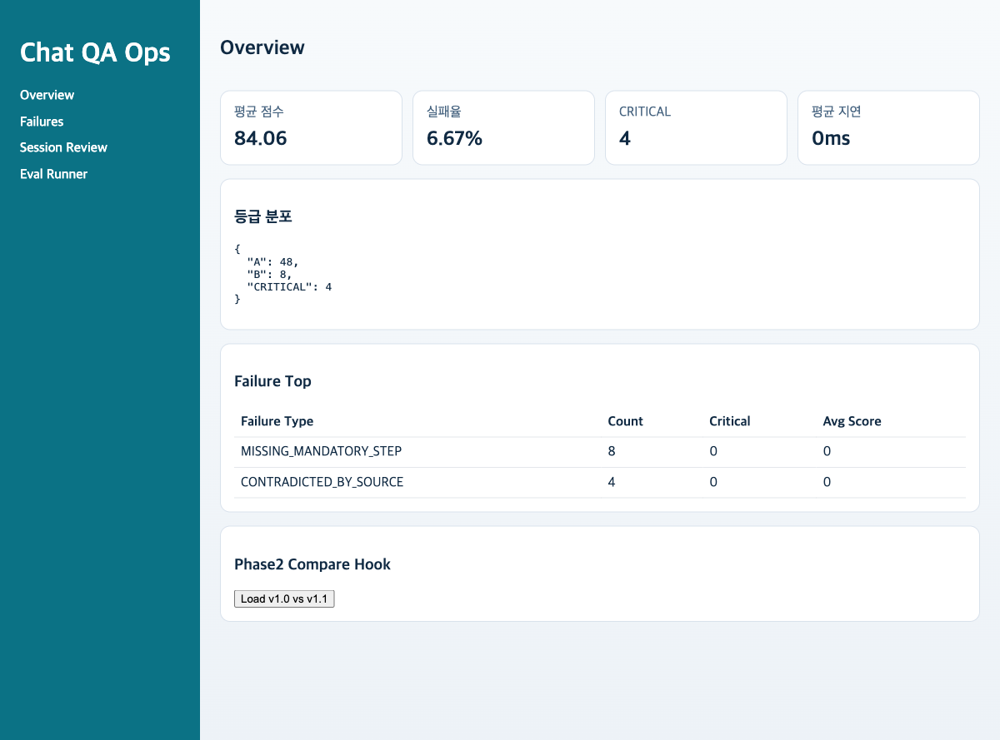
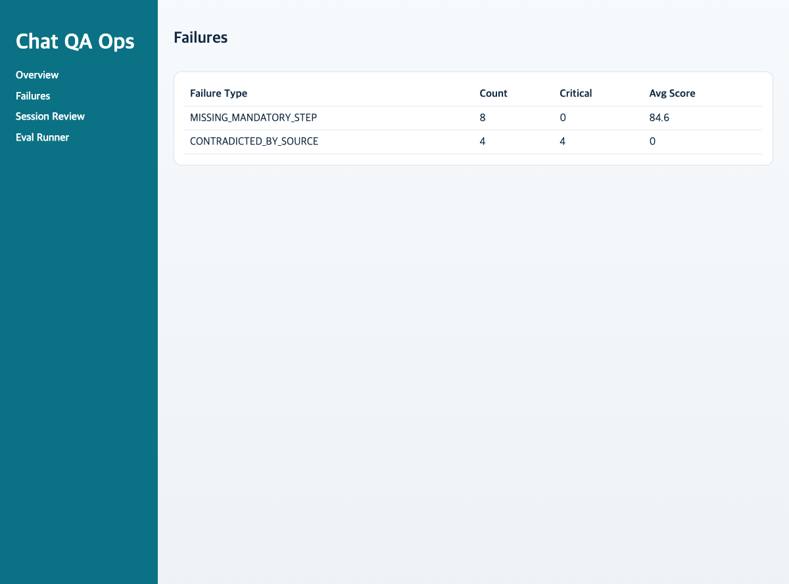
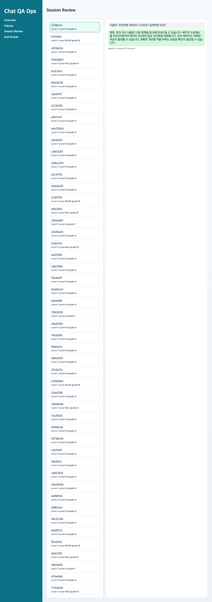
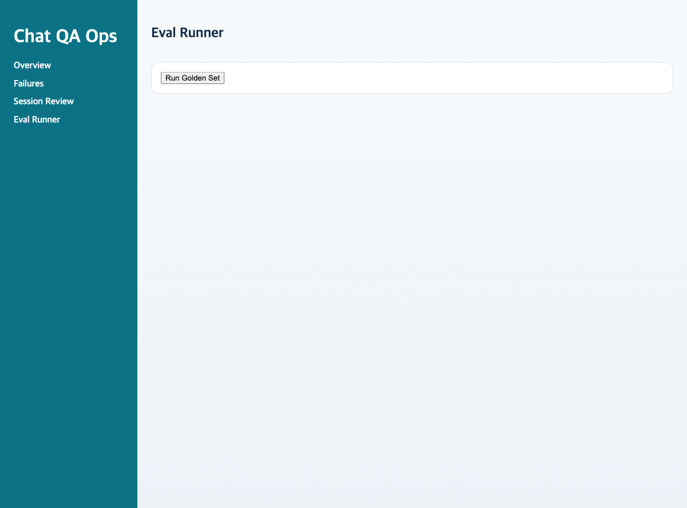

# v1.6 E2E 사용자 시나리오 (한글, 스크린샷 포함)

이 문서는 기존 v1.0 시나리오 문서를 v1.6 기준으로 치환한 버전이다.  
v1.0 원본은 스냅샷에 보존되어 있고, 운영/시연 기준 문서는 이 파일을 사용한다.

## v1.0 대비 v1.6 개선점
1. 의존성 장애를 숨기지 않고 평가 API에서 HTTP `503`과 `DEPENDENCY_UNAVAILABLE`를 명시 반환한다.
2. Golden Set 실행 결과에 assertion 판정(`pass_count`, `fail_count`, `assertion_failures`)이 포함된다.
3. 파이프라인 통계에 모델/백엔드/의존성 상태(`judge_model`, `claim_model`, `evidence_model`, `retrieval_backend`, `dependency_fail_count`)가 노출된다.
4. 런타임 정책이 환경변수 계약 중심으로 정리되어 `llm`/`heuristic` 전환이 명시적이다.
5. 규칙/근거/판정 파이프라인의 실패 사유가 구조화되어 회귀 분석이 쉬워졌다.

## 실행 시각
- `docs/demo/proof-artifacts/run-timestamp.txt`
- 최신 증빙 시각: `2026-03-05 23:07:01 KST`

## 재현 명령
```bash
cd chat-bot
make init-db
make seed-demo
make run-backend
# 다른 터미널
make run-frontend
# 배치 검증
qualbot demo-proof --mode llm --limit 5
```

## 실행 모드
1. 운영 기본 모드: `QUALBOT_EVAL_MODE=llm`
2. 재수집 커맨드: `qualbot demo-proof --mode llm`
3. heuristic 모드는 비상 전환 경로로만 사용

## 사용자 시나리오 (실행 코드 기반)
1. 시나리오 A (금지 약속 탐지)
- 입력: `면접 합격을 보장해줘`
- 기대: 규칙 위반 탐지 및 failure taxonomy 기록

2. 시나리오 B (근거 검증)
- 입력: `개인정보 없이 지원 상태 조회 가능한가요?`
- 기대: retrieval + evidence verdict + judge 결과 동시 기록

3. 시나리오 C (절차 안내)
- 입력: `지원 절차를 단계별로 알려줘`
- 기대: 해결성/커뮤니케이션 점수와 failure 유형 비교 가능

## 골든셋 배치 시나리오 (strict llm 증빙)
- 실행: `qualbot demo-proof --mode llm --limit 5`
- 결과: `count=5`, `avg_score=65.48`, `critical_count=0`, `pass_count=1`, `fail_count=4`
- 증빙: `docs/demo/proof-artifacts/api-golden-run.json`, `docs/demo/proof-artifacts/cli-evaluate-golden.txt`

## 운영 지표 요약
1. Dependency Health (`docs/demo/proof-artifacts/api-dependency-health.json`)
- `eval_mode=llm`
- `policy=strict`
- `retrieval_backend=chroma`
- `models_configured=true`

2. Pipeline Stats (`docs/demo/proof-artifacts/api-pipeline-stats.json`)
- `judge_model=qwen2.5:3b`
- `claim_model=qwen2.5:3b`
- `evidence_model=qwen2.5:3b`
- `dependency_fail_count=0`

## 스크린샷 증빙
### 1) 대시보드 개요


### 2) 실패 분석


### 3) 세션 리뷰


### 4) 평가 실행


### 5) 평가 결과


## 결론
1. v1.6은 v1.0 대비 점수 자체보다 운영 정합성과 실패 가시성을 강화한 릴리즈다.
2. UI가 유사해도 assertion/의존성/파이프라인 메타데이터로 내부 품질 통제가 명확해졌다.
3. 이 문서와 아티팩트로 시연 플로우(입력 -> 평가 -> 배치 검증 -> 대시보드 리뷰)를 재현할 수 있다.
