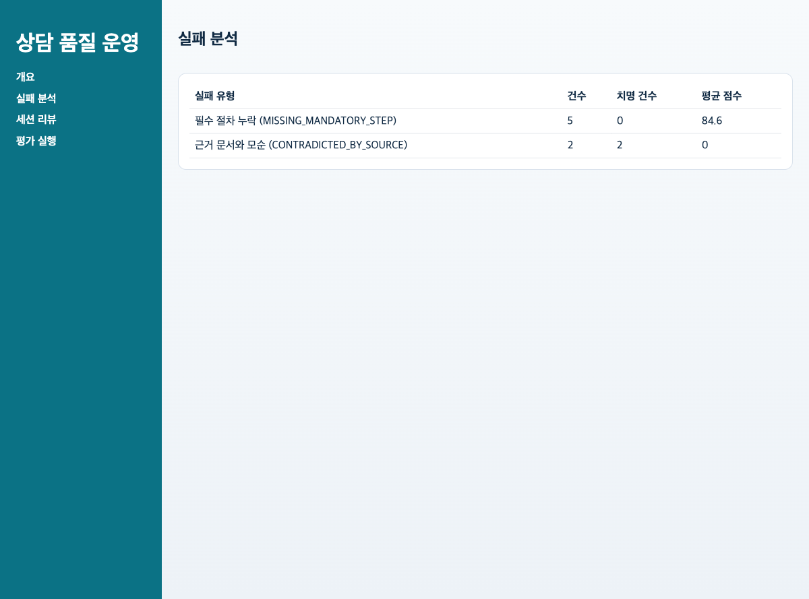

# v0 발표용 문서

## 발표 목적

- 한 줄 메시지: `v0`는 상담 품질 평가 파이프라인과 운영 대시보드가 실제로 끝까지 연결되는 첫 runnable baseline이다.
- 권장 시간: 6~7분
- 화면 캡처 세트: `2026-03-05 22:07:45 KST`
- CLI/API proof 재생성 시점: `2026-03-07 17:54:40 KST`

## 이걸로 할 수 있는 일

- 배포 직전에 `골든셋 평가`를 돌려 지금 상담 품질이 기준선을 넘는지 확인할 수 있다.
- 실패 유형을 바로 보고 어떤 정책/절차가 약한지 우선순위를 정할 수 있다.
- 위험 세션을 열어 사람이 마지막으로 검토하고 배포 보류 여부를 결정할 수 있다.

## 발표 첫 문장

- `v0`로 할 수 있는 일은 간단합니다. 상담 봇을 배포하기 전에 품질 게이트를 실제로 한 번 돌리고, 어디가 위험한지 운영자가 바로 판단할 수 있습니다.

## 발표 시나리오

- 역할: QA 운영 담당자
- 상황: 오늘 배포 후보 상담 봇이 정책 위반 없이 고객 문의를 처리하는지 빠르게 확인해야 한다.
- 목표: golden-set 평가를 실행하고, 대시보드에서 점수와 실패 유형을 확인한 뒤, 위험 세션을 열어 root cause를 설명한다.

## 실제 사용 사례

### 사례 1. 배포 직전 품질 게이트 점검

- 사용자: QA 운영 담당자
- 행동:
- `골든셋 평가 실행` 버튼을 눌러 배치 평가를 돌린다.
- Overview에서 평균 점수와 `CRITICAL` 개수를 먼저 본다.
- Failures에서 상위 실패 유형을 읽고 오늘 배포를 막아야 할지 판단한다.
- 실제 근거:
- [`runner-result-ko.png`](../demo/scenario-artifacts/runner-result-ko.png)
- [`overview-ko.png`](../demo/scenario-artifacts/overview-ko.png)
- [`failures-ko.png`](../demo/scenario-artifacts/failures-ko.png)
- 발표 메시지:
- 이 버전의 핵심 가치는 “품질 운영자가 배포 직전에 한 번에 상태를 읽을 수 있다”는 점이다.

### 사례 2. 위험 세션 수동 검토

- 사용자: QA 운영 담당자
- 행동:
- Session Review에서 위험 세션을 하나 연다.
- 사용자 질문과 답변을 나란히 보고, 필수 절차 누락 또는 근거 문서 모순 여부를 해석한다.
- 실제 근거:
- [`sessions-ko.png`](../demo/scenario-artifacts/sessions-ko.png)
- 발표 메시지:
- `v0`는 자동 평가와 사람 검토를 한 흐름으로 묶는 baseline이다.

## 발표 전 준비 명령

```bash
cd python
UV_PYTHON=python3.12 uv sync --extra dev
make init-db
make seed-demo
make run-backend
```

별도 터미널:

```bash
cd react
pnpm install
pnpm dev
```

## Slide 1. 왜 이 데모가 필요한가

- 메시지: 이 프로젝트의 목적은 상담 챗봇을 더 똑똑하게 만드는 것이 아니라, 배포 전에 품질을 막아 세우고 위험한 답변을 잡아내는 QA Ops 계층을 만드는 것이다.
- 보여줄 것: `rule -> evidence -> judge -> dashboard` 흐름을 설명하고, 지금부터 실제 화면으로 확인하겠다고 말한다.

## Slide 2. 평가 실행 화면


- 멘트: 먼저 운영자가 `골든셋 평가 실행`을 눌러 배치 평가를 돌린다.
- 강조 포인트:
- 평가 건수 `30`
- 평균 점수 `84.06`
- `CRITICAL` 건수 `2`
- 연결 근거: [`cli-report.txt`](../demo/scenario-artifacts/cli-report.txt)

```text
evaluated=30 avg_score=84.06 critical=2 pass_count=16 fail_count=14
assertion_failures=14
```

## Slide 3. 개요 화면에서 전체 상태 확인


- 멘트: Overview에서는 한 번에 평균 점수, 실패율, 치명 이슈, 등급 분포를 본다.
- 강조 포인트:
- 평균 점수 `84.5`
- 실패율 `6.06%`
- `CRITICAL 2`
- 등급 분포 `A 26 / B 5 / CRITICAL 2`

## Slide 4. 실패 분석 화면에서 어디가 약한지 확인



- 멘트: 숫자만 보여주면 개선 액션으로 이어지지 않기 때문에 실패 유형을 바로 본다.
- 실제 상위 실패 유형:
- `MISSING_MANDATORY_STEP` 9건
- `CONTRADICTED_BY_SOURCE` 4건
- 해석:
- 필수 안내 누락은 프로세스 가이드 보강 대상이다.
- 근거 문서와 모순은 위험도가 높아 세션 리뷰로 바로 내려가야 한다.

## Slide 5. 세션 리뷰 화면에서 수동 검토


- 멘트: 이 화면은 사람이 “왜 이 점수가 나왔는가”를 마지막으로 확인하는 곳이다.
- 발표 포인트:
- 좌측 목록에서 위험 세션을 고른다.
- 우측에서 사용자 질문과 응답을 같이 읽는다.
- `v0`는 여기서 운영자가 룰 위반 여부와 근거 문서 적합성을 직접 해석한다.

## Slide 6. 발표 마무리

- 핵심 결론: `v0`는 end-to-end baseline이 실제로 동작함을 증명한다.
- 청중 질문에 대한 직접 답변:
- `이걸로 할 수 있는 일은, 배포 직전에 상담 품질을 한 번에 검사하고 위험 세션을 사람이 즉시 검토하는 것입니다.`
- 오늘 보여준 실제 근거:
- Runner 화면 캡처
- Overview/Failures/Session Review 화면 캡처
- [`api-golden-run.json`](../demo/proof-artifacts/api-golden-run.json)
- [`api-overview.json`](../demo/proof-artifacts/api-overview.json)
- [`api-failures.json`](../demo/proof-artifacts/api-failures.json)
- 다음 버전으로 넘길 질문:
- 같은 화면 흐름 위에 운영 안정성과 traceability를 어떻게 추가할 것인가?
