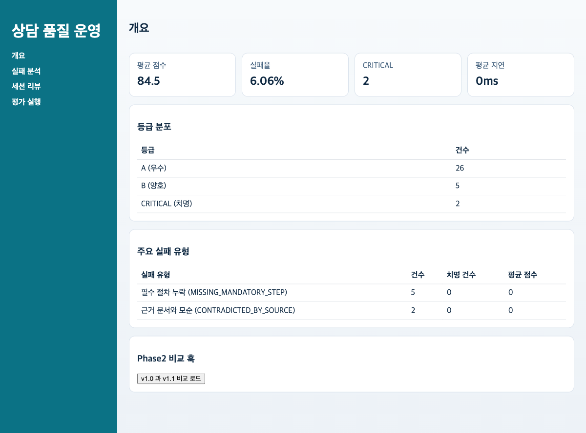

# v1 발표용 문서

## 발표 목적

- 한 줄 메시지: `v1`은 `v0`의 작동하는 데모를 운영 검증 가능한 QA Ops 도구로 강화한 버전이다.
- 권장 시간: 7~8분
- 화면 캡처 세트: `2026-03-05 22:07:45 KST`
- CLI/API proof 재생성 시점: `2026-03-07 17:31:00 KST`

## 이걸로 할 수 있는 일

- 품질 게이트를 돌리는 것에서 끝나지 않고, 왜 실패했는지 운영자가 추적할 수 있다.
- provider, storage, fallback 상태를 확인해 장애 상황에서도 대응 절차를 설명할 수 있다.
- 같은 화면 흐름 위에서 `이 결과를 믿어도 되는가`를 운영 관점에서 검증할 수 있다.

## 발표 첫 문장

- `v1`로 할 수 있는 일은 단순 데모 시연이 아니라, 품질 결과의 원인과 운영 위험까지 함께 설명하는 것입니다.

## 발표 시나리오

- 역할: QA 운영 리드
- 상황: 같은 평가 흐름을 쓰되, 이제는 “왜 이 결과가 나왔는지”와 “장애가 나면 어떻게 할지”까지 설명해야 한다.
- 목표: `v0`와 같은 사용자 흐름을 재사용하면서, 운영 안정성, fallback 준비, 버전 추적 가능성을 추가로 설명한다.

## 실제 사용 사례

### 사례 1. 운영 리드의 장애 점검 리허설

- 사용자: QA 운영 리드
- 행동:
- 배치 평가 전 `dependency health`와 `smoke-postgres`를 확인한다.
- provider 또는 storage 경로에 이상이 있으면 fallback 절차를 발표 중에 함께 설명한다.
- 실제 근거:
- [`api-dependency-health.json`](../demo/proof-artifacts/api-dependency-health.json)
- [`docs/release-readiness.md`](../../../docs/release-readiness.md)
- 발표 메시지:
- `v1`은 단순 데모가 아니라 “장애 시 어떻게 대응할지”까지 설명 가능한 운영 rehearsal 버전이다.

### 사례 2. 감사 가능한 세션 리뷰

- 사용자: QA 운영 리드
- 행동:
- Session Review에서 문제 세션을 열고, 왜 이 세션이 위험한지 설명한다.
- 이때 run lineage와 trace payload가 존재한다는 점을 함께 말한다.
- 실제 근거:
- [`sessions-ko.png`](../demo/scenario-artifacts/sessions-ko.png)
- [`api-golden-run.json`](../demo/proof-artifacts/api-golden-run.json)
- 발표 메시지:
- 같은 화면처럼 보여도 `v1`부터는 결과를 감사 가능한 단위로 추적할 수 있다는 점이 중요하다.

## 발표 전 준비 명령

```bash
cd python
UV_PYTHON=python3.12 uv sync --extra dev
make init-db
make seed-demo
make run-backend
```

별도 터미널:

```bash
cd react
pnpm install
pnpm dev
```

추가 검증:

```bash
UV_PYTHON=python3.12 make smoke-postgres
```

## Slide 1. 무엇이 달라졌는가

- 메시지: `v1`의 핵심은 새 화면이 아니라, 같은 화면 뒤에 운영자가 믿고 대응할 수 있는 계약을 붙인 것이다.
- 이번 버전의 키워드:
- provider chain: `Upstage Solar -> OpenAI -> Ollama`
- dependency health와 fallback contract
- run lineage, retrieval trace, claim trace, judge trace 준비
- PostgreSQL smoke path + SQLite fallback

## Slide 2. 배치 평가 실행은 그대로 유지한다


- 멘트: 운영자가 보는 첫 경험은 `v0`와 동일해야 한다. 그래야 비교가 쉽다.
- 실제 실행 결과:

```text
evaluated=30 avg_score=84.06 critical=2 pass_count=16 fail_count=14
assertion_failures=14
```

- 연결 포인트: 같은 baseline 흐름 위에 backend contract만 강화했다는 점을 강조한다.

## Slide 3. Overview와 Failures는 운영 지표의 입구다




- 멘트: 운영 콘솔이 답해야 하는 질문은 두 가지다.
- 지금 전체 품질이 어떤가?
- 어떤 failure type부터 고쳐야 하는가?
- 실제 상위 failure:
- `MISSING_MANDATORY_STEP` 9건
- `CONTRADICTED_BY_SOURCE` 4건

## Slide 4. Session Review가 운영형 화면으로 확장된다


- 멘트: `v1`부터는 세션 리뷰를 사람이 읽는 감사 화면으로 다뤄야 한다.
- 발표 포인트:
- 위험 세션을 하나 선택해 사용자 질문과 응답을 같이 보여준다.
- 여기서 trace와 lineage를 내려받아 “어느 run에서 왜 이런 답이 나왔는가”를 설명하는 구조로 간다.
- UI 캡처는 동일해 보여도, backend는 run label과 trace payload를 저장할 준비가 되어 있다.

## Slide 5. 운영 안정성은 화면 밖에서 증명한다

- 메시지: `v1`은 데모가 아니라 운영 rehearsal 버전이다.
- 실제 검증 명령:

```bash
UV_PYTHON=python3.12 make gate-all
UV_PYTHON=python3.12 make smoke-postgres
```

- 발표 멘트:
- provider가 죽으면 조용히 넘어가지 않고 health/fallback contract로 상태를 드러낸다.
- PostgreSQL smoke test로 SQLite fallback만 있는 toy demo가 아니라는 점을 확인했다.
- trace payload는 이후 `v2`의 compare proof로 이어진다.

## Slide 6. 발표 마무리

- 핵심 결론: `v1`은 “돌아간다”에서 끝나지 않고 “운영자가 믿고 검사할 수 있다”까지 범위를 넓힌 버전이다.
- 청중 질문에 대한 직접 답변:
- `이걸로 할 수 있는 일은, 품질 문제를 잡는 것뿐 아니라 장애와 원인을 추적하고 운영자가 대응 결정을 내리는 것입니다.`
- 오늘 보여준 실제 근거:
- Runner, Overview, Failures, Session Review 화면 캡처
- [`api-dependency-health.json`](../demo/proof-artifacts/api-dependency-health.json)
- [`api-golden-run.json`](../demo/proof-artifacts/api-golden-run.json)
- [`docs/release-readiness.md`](../../../docs/release-readiness.md)
- 다음 버전으로 넘길 질문:
- hardening이 끝난 뒤, retrieval 개선이 실제 품질 향상으로 이어졌음을 어떻게 수치로 증명할 것인가?
