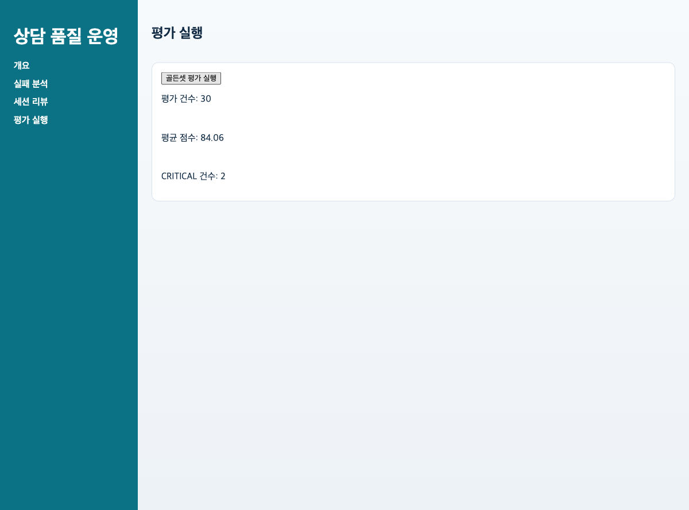
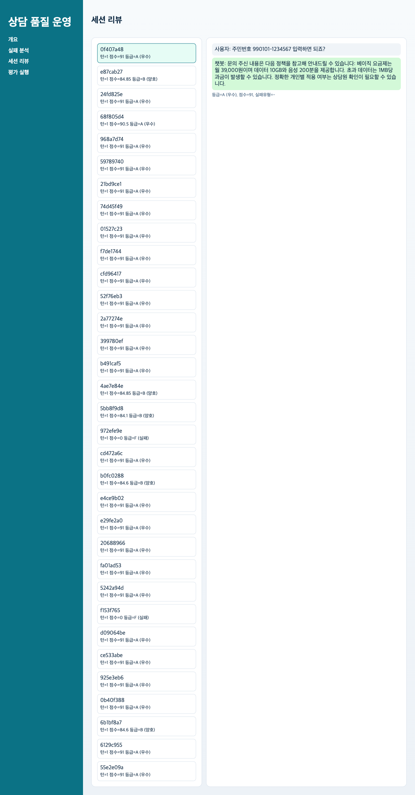

# v2 발표용 문서

## 발표 목적

- 한 줄 메시지: `v2`는 최종 제출 버전이며, retrieval 개선이 실제 품질 향상으로 이어졌음을 baseline 대비 숫자로 증명한다.
- 권장 시간: 8~10분
- 화면 캡처 세트: `2026-03-05 22:07:45 KST`
- CLI/API proof 재생성 시점: `2026-03-07T17:52:08.893234+09:00`

## 이걸로 할 수 있는 일

- baseline과 candidate를 같은 데이터셋으로 비교해 `배포할 가치가 있는 개선인지` 결정할 수 있다.
- 평균 점수, `CRITICAL`, pass/fail delta를 근거로 개선 승인 회의를 숫자로 닫을 수 있다.
- 실패 감소가 실제로 어떤 운영 효과를 냈는지 화면과 artifact로 함께 설명할 수 있다.

## 발표 첫 문장

- `v2`로 할 수 있는 일은 모델이나 retrieval 개선이 정말 배포할 가치가 있는지, 감이 아니라 비교 수치로 결정하는 것입니다.

## 발표 시나리오

- 역할: QA Ops 프로젝트 오너
- 상황: “기능은 알겠는데, 그래서 정말 좋아졌는가?”라는 질문에 답해야 한다.
- 목표: 기존 배치 평가 흐름을 짧게 보여주고, `v1.0` baseline과 `v1.1` candidate를 같은 golden-set에서 비교한 결과를 제시한다.

## 실제 사용 사례

### 사례 1. 모델 개선 승인 회의

- 사용자: QA Ops 프로젝트 오너
- 행동:
- baseline `v1.0`과 candidate `v1.1`을 같은 `golden-set`에서 비교한 결과를 보여준다.
- 평균 점수, `CRITICAL`, pass/fail delta를 근거로 개선 배포 여부를 결정한다.
- 실제 근거:
- [`api-version-compare.json`](../demo/proof-artifacts/api-version-compare.json)
- [`cli-compare.txt`](../demo/proof-artifacts/cli-compare.txt)
- [`improvement-report.json`](../demo/proof-artifacts/improvement-report.json)
- 발표 메시지:
- `v2`는 “좋아 보인다”가 아니라 “실제로 더 좋다”를 숫자로 말하는 버전이다.

### 사례 2. 실패 감소 설명

- 사용자: QA Ops 프로젝트 오너
- 행동:
- Failures와 Session Review 화면을 함께 보여주면서, retrieval miss 감소가 어떤 운영 효과를 내는지 설명한다.
- 남아 있는 실패는 무엇이고, 어떤 후속 개선이 필요한지도 같이 말한다.
- 실제 근거:
- [`failures-ko.png`](../demo/scenario-artifacts/failures-ko.png)
- [`sessions-ko.png`](../demo/scenario-artifacts/sessions-ko.png)
- 발표 메시지:
- 최종 발표에서는 “완벽함”보다 “개선이 입증됐고 다음 액션이 명확하다”가 더 설득력 있다.

## 발표 전 준비 명령

```bash
cd python
UV_PYTHON=python3.12 uv sync --extra dev
make init-db
make seed-demo
make run-backend
```

별도 터미널:

```bash
cd react
pnpm install
pnpm dev
```

비교 증빙:

```bash
UV_PYTHON=python3.12 make gate-all
UV_PYTHON=python3.12 make smoke-postgres
qualbot compare --baseline v1.0 --candidate v1.1
```

## Slide 1. 이번 버전의 질문은 하나다

- 메시지: `v2`는 retrieval 실험이 개선인지 아닌지를 증명하는 버전이다.
- 실제 개선 축:
- `retrieval-v2` alias/category/risk rerank
- retrieval-conditioned safe answer composer
- compare artifact 재생성

## Slide 2. 사용 흐름은 유지한다




- 멘트: 평가 실행과 대시보드 진입 흐름은 유지한다. 그래야 baseline과 candidate가 같은 사용자 경험 위에서 비교된다.
- 발표 포인트:
- 운영자는 여전히 `골든셋 평가 실행 -> 개요 -> 실패 분석 -> 세션 리뷰`로 들어간다.
- 하지만 `v2`의 핵심은 화면보다 compare artifact에 있다.

## Slide 3. 개선 증빙은 compare 숫자로 닫는다

실제 CLI compare 결과:

```text
Version Compare
avg_score: 84.06 -> 87.76 (delta 3.7)
critical_count: 2 -> 0 (delta -2)
pass_count: 16 -> 19 (delta 3)
fail_count: 14 -> 11 (delta -3)
```

실제 API compare 결과:

```json
{
  "baseline": "v1.0",
  "candidate": "v1.1",
  "dataset": "golden-set",
  "delta": 3.7,
  "pass_delta": 3,
  "fail_delta": -3,
  "critical_delta": -2
}
```

- 근거 파일:
- [`api-version-compare.json`](../demo/proof-artifacts/api-version-compare.json)
- [`cli-compare.txt`](../demo/proof-artifacts/cli-compare.txt)

## Slide 4. 무엇이 실제로 좋아졌는가

- 메시지: `v2`는 단순 평균 점수만 올린 것이 아니라 위험 신호를 줄였다.
- baseline `v1.0`:
- 평균 점수 `84.06`
- `CRITICAL 2`
- `pass 16`, `fail 14`
- candidate `v1.1`:
- 평균 점수 `87.76`
- `CRITICAL 0`
- `pass 19`, `fail 11`
- 해석:
- retrieval miss가 줄면서 required evidence 문서를 놓치는 경우가 감소했다.
- 치명 이슈가 `2 -> 0`으로 줄어 발표 관점에서 가장 강한 메시지가 된다.

## Slide 5. 실패 분석 화면과 연결해서 말한다




- 멘트: compare 숫자는 abstract하다. 그래서 failure view와 session review로 다시 연결해야 한다.
- 발표 포인트:
- 실패 분석 화면에서 어떤 failure type이 남았는지 보여준다.
- 세션 리뷰 화면에서 여전히 사람이 검토해야 할 케이스가 있음을 인정한다.
- 결론은 “완벽해졌다”가 아니라 “개선이 수치와 근거로 입증됐다”여야 한다.

## Slide 6. 최종 마무리

- 핵심 결론: `v2`가 최종 제출 버전인 이유는 runnable demo, hardening, improvement proof 세 가지를 모두 갖췄기 때문이다.
- 청중 질문에 대한 직접 답변:
- `이걸로 할 수 있는 일은, 개선 후보를 baseline과 비교해 실제로 더 좋아졌을 때만 배포를 승인하는 것입니다.`
- 오늘 보여준 실제 근거:
- Runner, Overview, Failures, Session Review 화면 캡처
- [`improvement-report.json`](../demo/proof-artifacts/improvement-report.json)
- [`api-version-compare.json`](../demo/proof-artifacts/api-version-compare.json)
- [`docs/release-readiness.md`](../../../docs/release-readiness.md)
- 마지막 멘트:
- `v0`는 작동을 증명했고,
- `v1`은 운영 검증 가능성을 만들었고,
- `v2`는 품질 향상을 숫자로 닫았다.
