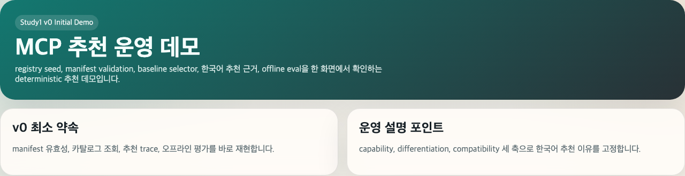
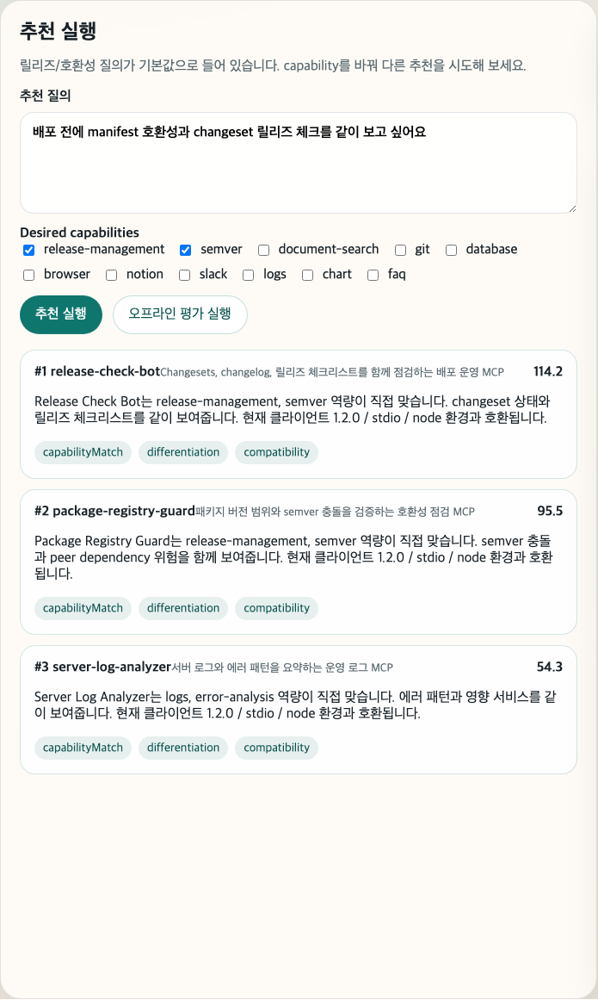
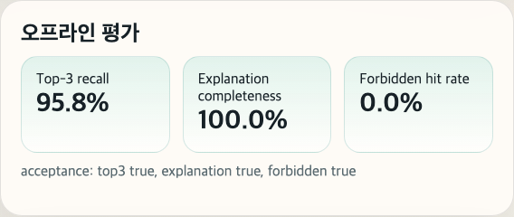

# 인포뱅크 1번 과제 capstone
## v0 초기 실행 데모

baseline selector와 offline eval이 실제로 동작하는 첫 runnable 데모  
검증일: 2026-03-07

---

# 1. v0의 역할

- `v0`는 capstone의 출발점이다.
- seeded registry, manifest validation API, baseline selector, 한국어 추천 근거, offline eval을 한 번에 묶는다.
- 목표는 "추천이 가능한가"를 증명하는 것이다.

발표 포인트

- 이 단계에서는 운영 승인보다 baseline의 재현성과 설명 가능성이 더 중요하다.
- 이후 `v1`, `v2`는 모두 이 baseline 위에 쌓인다.

---

# 2. 데모 시나리오

상황

- 운영자가 "배포 전에 manifest 호환성과 릴리즈 체크를 같이 보고 싶다"는 한국어 질의를 입력한다.
- 시스템은 seeded catalog에서 가장 적합한 MCP를 고르고, 이유를 한국어로 설명해야 한다.
- 추천 이후에는 offline eval을 돌려 baseline 품질이 acceptance 기준을 넘는지 확인한다.

이번 데모 흐름

1. 초기 화면에서 `v0`의 범위를 보여준다.
2. baseline 추천을 실행한다.
3. 추천 근거가 capability, differentiation, compatibility 축으로 나오는지 확인한다.
4. offline eval을 실행해 정량 기준을 확인한다.

---

# 3. 실사용 사례

사용자

- 역할: SaaS 운영팀의 릴리즈 담당자
- 문제: 배포 직전에 어떤 MCP를 먼저 붙여야 manifest 호환성과 릴리즈 체크를 같이 검증할 수 있는지 빠르게 판단해야 한다.

실제 입력

- 질의: `배포 전에 manifest 호환성과 changeset 릴리즈 체크를 같이 보고 싶어요`
- desired capabilities: `release-management`, `semver`

기대 결과

- `release-check-bot`가 top 추천으로 나온다.
- 추천 이유가 한국어로 정리된다.
- offline eval 기준을 함께 제시해서 "이 추천이 우연이 아니다"를 설명할 수 있다.

발표 멘트

- "v0의 사용자 가치는 빠른 사전 판단입니다. 운영자가 질문을 한 번 넣으면, 어떤 MCP를 먼저 붙여야 하는지와 그 이유를 바로 확인할 수 있습니다."

---

# 4. 그래서 v0로 뭘 할 수 있나

- 한국어 운영 질문을 바로 MCP 추천 요청으로 바꿀 수 있다.
- seeded catalog 안에서 어떤 MCP를 먼저 검토해야 할지 빠르게 좁힐 수 있다.
- 추천 이유를 capability, differentiation, compatibility 축으로 즉시 설명할 수 있다.
- offline eval로 baseline 품질이 acceptance 기준을 넘는지 바로 증명할 수 있다.

한 줄 가치

> `v0`는 "무엇을 붙일지"와 "왜 그게 맞는지"를 빠르게 정리해 주는 baseline 추천 데모다.

---

# 5. 화면 1: v0 개요



설명

- hero 영역에서 `v0`의 범위가 명확히 드러난다.
- 한 화면 안에 추천 실행, 평가, 카탈로그 샘플이 모두 배치되어 있다.

데모 멘트

- "이 버전은 추천 시스템의 최소 약속을 검증하는 단계입니다. 추천과 평가를 같은 화면에서 바로 재현합니다."

---

# 6. 화면 2: Baseline 추천 실행



핵심 메시지

- `release-check-bot`가 top 추천으로 선택된다.
- 추천 이유는 deterministic template로 생성된다.
- 운영자에게 보여주는 설명은 세 축으로 제한된다.
  - capability match
  - differentiation
  - compatibility

데모 멘트

- "설명 품질은 자유 생성 문장이 아니라, 운영자가 바로 검증할 수 있는 고정 근거 구조로 설계했습니다."

---

# 7. 화면 3: Offline Eval



검증 의도

- UI 데모만 있으면 안 되고, seeded evaluation set에서 반복 실행 가능한 품질 기준이 필요하다.
- `v0`는 여기서 top-3 recall, explanation completeness, forbidden hit rate를 확인한다.

데모 멘트

- "이 프로젝트는 추천 화면 자체보다, 그 화면이 acceptance 기준을 만족한다는 점이 중요합니다."

---

# 8. 화면 4: Seeded Catalog


의미

- 추천이 빈 화면에서 임의로 생성되는 것이 아니라, 구조화된 registry seed를 대상으로 실행된다.
- 도구 category, maturity, release channel이 함께 노출되어 설명과 후속 확장에 사용된다.

---

# 9. 정량 검증 결과

검증 명령

```bash
pnpm eval
pnpm capture:presentation
```

실측 결과

| 항목 | 결과 | 기준 |
| --- | --- | --- |
| top-3 recall | `0.9583` | `>= 0.90` |
| explanation completeness | `1.00` | `= 1.00` |
| forbidden hit rate | `0.00` | `= 0.00` |

의미

- `v0`만으로도 baseline selector와 한국어 설명 계약이 acceptance를 만족한다.
- 이 결과가 이후 `v1` rerank와 `v2` release gate의 기준선이 된다.

---

# 10. 결론

- `v0`는 capstone의 첫 runnable baseline이다.
- seeded registry, baseline selector, 한국어 추천 근거, offline eval이 실제로 연결돼 있다.
- 발표에서는 "출발점이 재현 가능하게 닫혀 있다"는 점을 강조하면 된다.

재현 경로

```bash
pnpm install
pnpm db:up
pnpm migrate
pnpm seed
pnpm dev
pnpm capture:presentation
```
