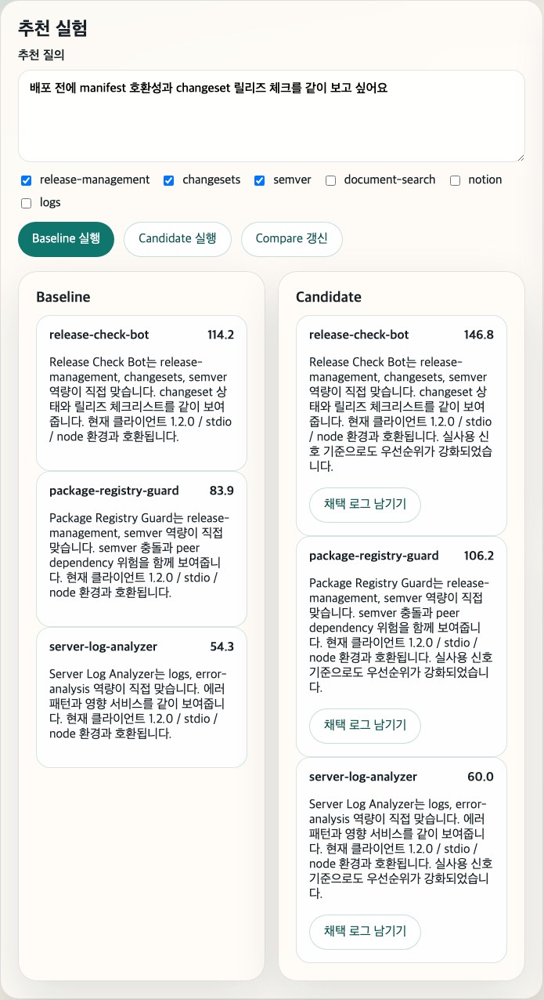
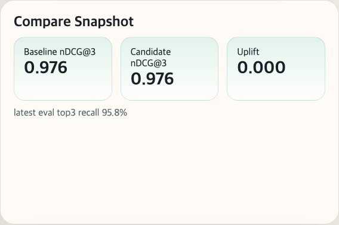
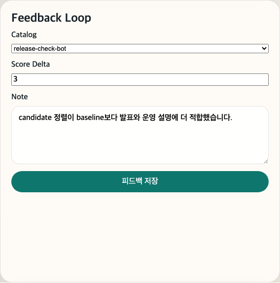
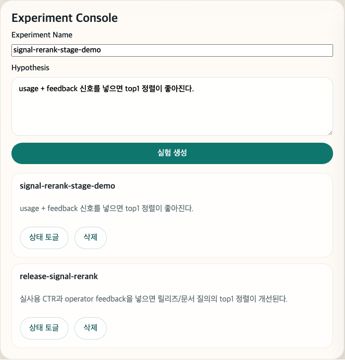

# Study1 Capstone
## v1 Ranking Hardening

baseline 위에 usage, feedback, rerank compare를 얹은 운영 실험 콘솔  
검증일: 2026-03-07

---

# 1. 왜 v1이 필요한가

- `v0`는 baseline 추천과 eval을 증명했다.
- 하지만 실제 운영에서는 "추천이 왜 더 나아졌는가"와 "실사용 신호가 반영되었는가"가 필요하다.
- `v1`은 reranker, usage logs, feedback loop, experiment CRUD, baseline/candidate compare를 추가한다.

발표 포인트

- `v1`의 핵심은 더 똑똑한 추천 자체보다, 개선 여부를 비교 가능한 실험 체계로 만든 데 있다.

---

# 2. 데모 시나리오

상황

- 운영팀은 같은 릴리즈 질의에 대해 baseline과 candidate를 나란히 보고 싶다.
- candidate는 usage CTR, accept rate, operator feedback, explanation quality, freshness를 반영한다.
- 운영자는 추천을 채택하고 피드백을 남긴 뒤, compare snapshot과 실험 설정을 갱신한다.

이번 데모 흐름

1. baseline과 candidate를 둘 다 실행한다.
2. candidate 설명이 운영 신호 때문에 강화되었는지 확인한다.
3. compare snapshot을 갱신해 uplift를 본다.
4. 채택 로그와 피드백을 남긴다.
5. 실험을 추가해 운영자가 실험 단위를 관리하는 흐름을 보여준다.

---

# 3. 실사용 사례

사용자

- 역할: 추천 운영 실험을 담당하는 Ops PM
- 문제: baseline 추천은 충분히 맞지만, 실사용 로그와 운영자 피드백을 반영한 candidate가 실제 운영에서 더 설득력 있는지 검증해야 한다.

실제 입력

- 질의: `배포 전에 manifest 호환성과 changeset 릴리즈 체크를 같이 보고 싶어요`
- 비교 대상: `weighted-baseline-v0` vs `signal-rerank-v1`
- 후속 행동: candidate 채택 로그 기록, feedback note 저장, 실험 생성

기대 결과

- baseline과 candidate를 같은 화면에서 비교할 수 있다.
- candidate 설명이 실사용 신호를 반영한 이유를 포함한다.
- compare, usage, feedback, experiment가 하나의 운영 루프로 연결된다.

발표 멘트

- "v1의 실제 사용자는 모델 개발자가 아니라 운영 실험 담당자입니다. 이 사람은 추천 하나보다, 추천이 왜 달라졌고 어떤 신호가 쌓였는지를 보고 싶어합니다."

---

# 4. 그래서 v1로 뭘 할 수 있나

- baseline과 candidate 추천을 같은 화면에서 비교할 수 있다.
- usage log와 operator feedback을 실제 운영 신호로 적재할 수 있다.
- compare snapshot으로 개선 여부와 non-regression을 확인할 수 있다.
- 실험 이름, 가설, 상태를 기록하면서 추천 개선을 운영 프로세스로 바꿀 수 있다.

한 줄 가치

> `v1`는 "추천이 좋아 보인다"를 넘어서 "어떻게 비교하고 어떤 신호로 개선할지"를 운영할 수 있게 만든다.

---

# 5. 화면 1: v1 개요


설명

- `v1`부터는 대시보드 이름이 `MCP 실험 콘솔`로 바뀐다.
- 추천 결과만 보는 데모에서 운영 실험 화면으로 성격이 바뀐 단계다.

---

# 6. 화면 2: Baseline vs Candidate



핵심 메시지

- 같은 질의에 대해 baseline과 candidate를 나란히 비교한다.
- candidate 설명에는 "실사용 신호 기준으로도 우선순위가 강화되었습니다." 문장이 추가된다.
- 즉, 추천 이유가 static match에서 operational signal-aware ranking으로 확장된다.

데모 멘트

- "여기서 중요한 건 top 추천 하나가 아니라, candidate가 어떤 근거로 baseline과 달라졌는지 설명된다는 점입니다."

---

# 7. 화면 3: Compare Snapshot



이번 seeded 실행의 핵심 수치

- `baselineNdcg3 = 0.9759`
- `candidateNdcg3 = 0.9759`
- `uplift = 0.0000`

해석

- candidate는 baseline과 같은 품질을 유지했고, regression은 발생하지 않았다.
- 즉시 uplift가 크지 않더라도 compare 체계와 운영 신호 수집 경로가 먼저 갖춰졌다.
- `v2`는 이 compare 결과 위에 release gate 기준을 추가한 단계다.

---

# 8. 화면 4: Usage + Feedback



설명

- 운영자는 candidate 추천을 채택하면서 usage event를 남긴다.
- 이어서 feedback loop에서 score delta와 노트를 기록한다.
- 이 신호는 다음 candidate rerank에 반영되는 deterministic feature 입력이다.

데모 멘트

- "v1부터 추천은 일회성 응답이 아니라, 로그와 피드백을 통해 다시 학습되는 운영 루프로 바뀝니다."

---

# 9. 화면 5: Experiment Console



의미

- 운영자는 실험 이름과 가설을 기록하고 상태를 관리한다.
- compare 결과를 ad-hoc 확인하는 수준을 넘어서, 실험 단위로 운영 기록을 남길 수 있다.

---

# 10. 정량 검증 결과

검증 근거

- `pnpm eval`
- `POST /api/compare/run`
- `pnpm capture:presentation`

실측 결과

| 항목 | 결과 | 기준 |
| --- | --- | --- |
| top-3 recall | `0.9583` | `>= 0.90` |
| explanation completeness | `1.00` | `= 1.00` |
| forbidden hit rate | `0.00` | `= 0.00` |
| baseline nDCG@3 | `0.9759` | reference |
| candidate nDCG@3 | `0.9759` | `>= baseline` |
| uplift | `0.0000` | non-regression 확인 |

---

# 11. 결론

- `v1`은 추천 결과를 운영 실험으로 바꾼 단계다.
- reranking, usage logs, feedback, compare snapshot이 하나의 콘솔로 연결된다.
- 발표에서는 "`v0`가 baseline의 증명이라면, `v1`은 개선과 비교의 증명"이라고 설명하면 된다.

재현 경로

```bash
pnpm install
pnpm db:up
pnpm migrate
pnpm seed
pnpm dev
pnpm capture:presentation
```
