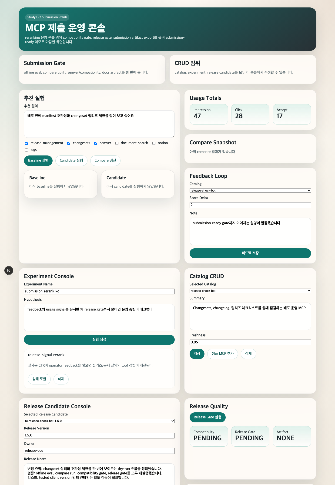
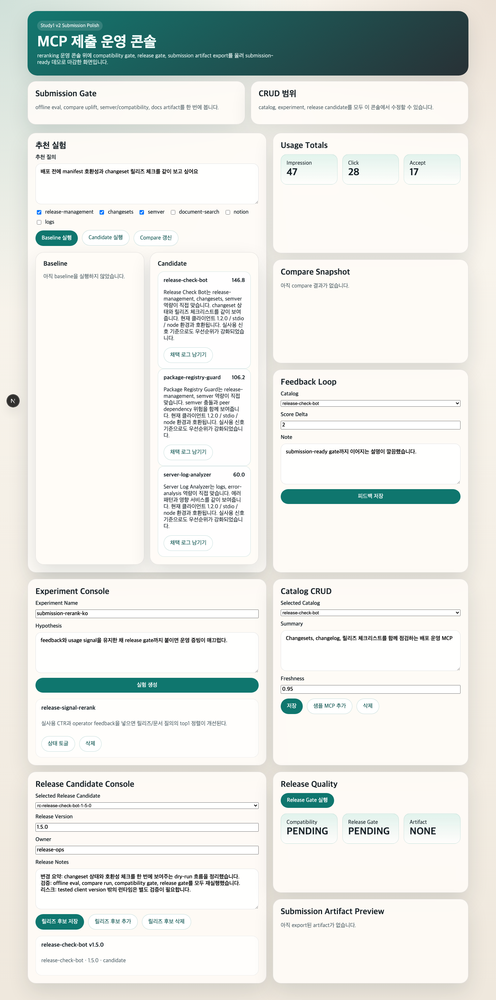
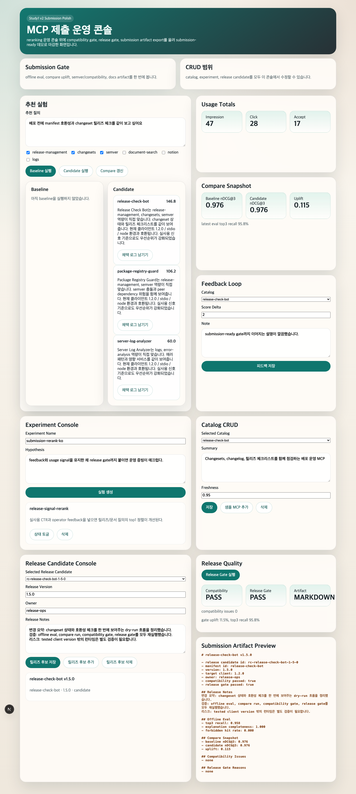

# 인포뱅크 1번 과제 capstone 최종본
## v2 제출 마감

운영형 MCP 추천 시스템 데모  
검증일: 2026-03-07

---

# 1. 왜 v2가 최종 버전인가

- `v0`: registry seed, manifest validation, baseline selector, 한국어 추천 근거, offline eval
- `v1`: reranking, usage logs, feedback loop, baseline/candidate compare
- `v2`: compatibility gate, release gate, submission artifact export, dry-run release pipeline
- 따라서 `v2`는 추천 정확도만이 아니라 운영 승인과 제출 증빙까지 닫힌 최종 캡스톤이다.

발표 포인트

- 이 프로젝트의 목표는 "추천 모델"이 아니라 "운영 가능한 추천 시스템"을 만드는 것이다.
- `v2`에서 처음으로 추천, 비교, 릴리즈 승인, 제출 산출물이 하나의 흐름으로 연결된다.

---

# 2. 데모 시나리오

상황

- 한국 SaaS 운영팀이 새 MCP `release-check-bot@1.5.0`를 릴리즈 후보로 검토한다.
- 팀은 `changesets`, `semver`, `release note` 검증이 가능한 MCP를 원한다.
- 운영자는 추천 이유를 한국어로 받아야 하고, baseline 대비 성능 저하가 없음을 확인한 뒤 제출용 artifact까지 생성해야 한다.

이번 데모에서 보여줄 것

1. 운영 콘솔에서 후보 추천을 실행한다.
2. candidate rerank 결과와 한국어 추천 근거를 확인한다.
3. baseline 대비 compare snapshot을 갱신한다.
4. compatibility gate와 release gate를 통과시킨다.
5. submission artifact preview를 발표/제출 증빙으로 사용한다.

---

# 3. 실사용 사례

사용자

- 역할: 릴리즈 승인 권한이 있는 플랫폼 운영 리드
- 문제: 새 MCP `release-check-bot@1.5.0`를 운영에 올리기 전에 호환성, 추천 적합성, 비교 지표, 제출 문서까지 한 번에 확인해야 한다.

실제 입력

- 추천 질의: `배포 전에 manifest 호환성과 changeset 릴리즈 체크를 같이 보고 싶어요`
- release candidate: `rc-release-check-bot-1-5-0`
- 승인 기준: compatibility pass, release gate pass, artifact export 완료

기대 결과

- candidate 추천과 한국어 근거를 확인한다.
- compare와 gate 결과가 한 화면에서 연결된다.
- 최종적으로 submission artifact preview를 발표/제출 문서로 그대로 사용할 수 있다.

발표 멘트

- "v2의 실제 사용자는 승인권자입니다. 이 사람에게 필요한 것은 좋은 추천 하나가 아니라, 배포 가능한 상태인지 끝까지 증명된 흐름입니다."

---

# 4. 그래서 v2로 뭘 할 수 있나

- MCP 릴리즈 후보를 추천, 비교, 호환성 검증까지 한 번에 검토할 수 있다.
- compatibility gate와 release gate로 승인 가능 여부를 명시적으로 판정할 수 있다.
- 승인 근거를 submission artifact로 즉시 내보낼 수 있다.
- 즉, 운영자의 수작업 체크리스트를 재현 가능한 시스템 흐름으로 바꿀 수 있다.

한 줄 가치

> `v2`는 "이 MCP를 운영에 올려도 되는가?"를 추천부터 승인 문서까지 한 번에 답하는 최종 캡스톤이다.

---

# 5. 화면 1: 운영 콘솔 개요



발표 포인트

- 하나의 화면에서 catalog, recommendation, compare, release candidate, artifact preview를 함께 본다.
- 운영자가 separate tool 없이 승인 흐름을 끝낼 수 있도록 구성했다.

데모 멘트

- "이 화면이 최종 v2 대시보드입니다. 추천 결과만 보는 것이 아니라, 바로 compare와 release gate까지 이어집니다."

---

# 6. 화면 2: Candidate 추천과 한국어 근거



핵심 메시지

- candidate reranker가 baseline top-k를 다시 정렬한다.
- 설명은 세 축으로 제한된다.
  - capability match
  - differentiation
  - compatibility
- 설명 문장은 deterministic template이라 재현성과 테스트 가능성을 유지한다.

데모 멘트

- "운영자가 보는 것은 점수만이 아닙니다. 왜 `Release Check Bot`가 맞는지 한국어로 바로 읽을 수 있어야 합니다."

---

# 7. 화면 3: Baseline vs Candidate Compare


이번 실행의 핵심 수치

- `baselineNdcg3 = 0.9759`
- `candidateNdcg3 = 0.9759`
- `uplift = 0.1146`

해석

- `nDCG@3`는 baseline과 동률을 유지했다.
- weighted uplift는 `+0.1146`로 gate 기준 `+0.02`를 넘겼다.
- 즉, 후보 모델은 안전성을 깨지 않으면서 운영 신호 기준으로 우선순위를 개선했다.

---

# 8. 화면 4: Compatibility + Release Gate PASS


gate에서 확인한 항목

- manifest schema 유효성
- runtime range 적합성
- semver bump consistency
- deprecated field 미사용
- 한국어 메타데이터 완전성
- offline eval acceptance
- compare uplift 임계치
- required docs/artifacts 존재 여부

데모 멘트

- "추천이 좋다는 것만으로는 릴리즈할 수 없습니다. v2는 추천과 승인 기준을 같은 화면에서 묶습니다."

---

# 9. 화면 5: Submission Artifact Preview



artifact에 포함되는 내용

- release notes
- offline eval summary
- compare summary
- compatibility summary
- release gate 판정

발표 포인트

- 발표나 제출 단계에서 다시 수작업으로 정리하지 않도록, 시스템이 마지막 증빙 문서를 만들어 준다.

---

# 10. 정량 검증 결과

검증 명령

```bash
pnpm eval
pnpm compatibility rc-release-check-bot-1-5-0
pnpm release:gate rc-release-check-bot-1-5-0
pnpm capture:presentation
```

실측 결과

| 항목 | 결과 | 기준 |
| --- | --- | --- |
| top-3 recall | `0.9583` | `>= 0.90` |
| explanation completeness | `1.00` | `= 1.00` |
| forbidden hit rate | `0.00` | `= 0.00` |
| compatibility gate | `PASS` | 전 항목 통과 |
| release gate | `PASS` | eval, compare, docs, artifact 전부 통과 |

발표 멘트

- "이 프로젝트는 데모용 UI만 있는 것이 아니라, acceptance 기준이 실제 수치로 닫혀 있습니다."

---

# 11. 발표 결론

- `v2`는 `study1` 캡스톤의 최종 버전이다.
- 추천, rerank, compare, compatibility, release gate, artifact export가 하나의 운영 경로로 연결된다.
- 한국어 설명과 deterministic evaluation을 유지해서 데모와 테스트를 같은 근거로 재현할 수 있다.

한 줄 요약

> v2는 "MCP를 추천하는 시스템"이 아니라 "MCP 추천을 운영 승인까지 연결하는 시스템"이다.

---

# 12. 재현 경로

로컬 실행

```bash
pnpm install
cp .env.example .env
pnpm db:up
pnpm migrate
pnpm seed
pnpm dev
```

발표 자료 재생성

```bash
pnpm capture:presentation
```

참고 문서

- `docs/runbook.md`
- `docs/eval-proof.md`
- `docs/compare-report.md`
- `docs/release-gate-proof.md`
