# Incident Ops Mobile Client Portfolio Presentation

## Presentation Goal

이 문서는 `incident-ops-mobile-client`를 React Native 채용 제출용 완성작으로 설명하기 위한 발표 스크립트다.
핵심 메시지는 세 가지다.

1. role-based incident workflow를 실제 RN 앱으로 구현했다.
2. outbox, replay, shared contract 같은 모바일 시스템 문제를 제품 UX 안으로 가져왔다.
3. 데모가 문장 설명이 아니라 실제 시뮬레이터 캡처와 재현 가능한 flow로 남아 있다.

## Demo Setup

- Capture environment: iPhone 16 simulator, iOS 18.6
- Backend: local `node-server`, `http://127.0.0.1:4100`
- Automation: Maestro 2.2.0
- Capture flows:
  - `react-native/maestro/01-portfolio-core.yaml`
  - `react-native/maestro/02-portfolio-outbox-recovery.yaml`

## Recommended Talk Track

### Slide 1. Problem Framing

이 앱은 “incident가 생성되고, operator가 확인하고, approver가 최종 승인하는 흐름”을 모바일에서 끝까지 다루는 과제다.
일반 CRUD가 아니라 role-based action, audit trail, offline queue, replay-safe realtime을 함께 증명하는 데 초점을 뒀다.

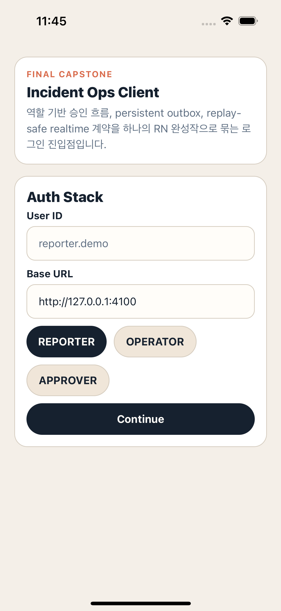

### Slide 2. Reporter Entry

발표에서는 먼저 reporter 관점에서 시작한다.
이 화면에서 base URL을 바꿀 수 있기 때문에 로컬 서버 데모와 장애 시나리오를 같은 앱 안에서 재현할 수 있다.

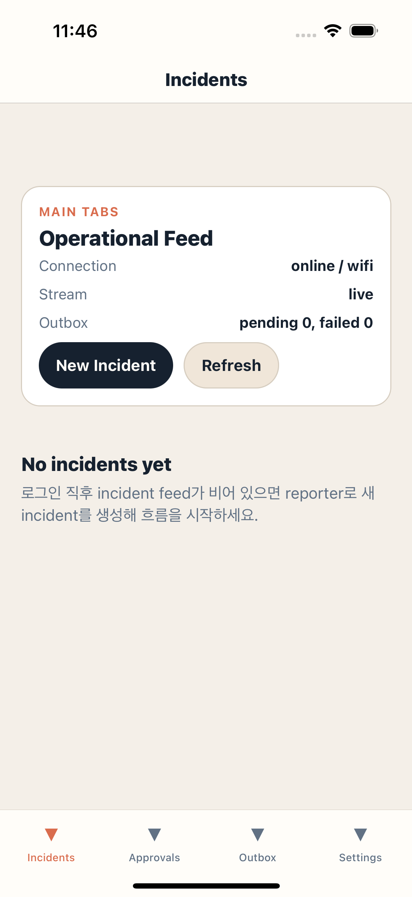

### Slide 3. Incident Creation

두 번째 포인트는 “모바일 폼이 시스템 흐름의 시작점”이라는 점이다.
incident 생성은 단순 입력 폼이 아니라 outbox와 audit trail의 첫 이벤트를 만드는 시작 버튼이다.

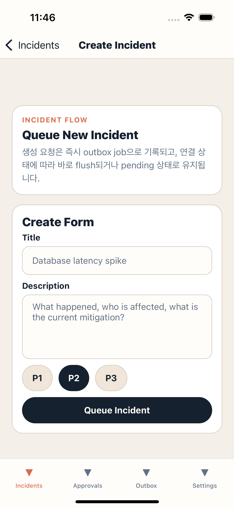

### Slide 4. Feed Reflection

incident를 생성하면 feed가 즉시 갱신된다.
발표에서는 이 장면에서 “React Query cache + local app model이 feed를 구성한다”는 점을 짚는다.

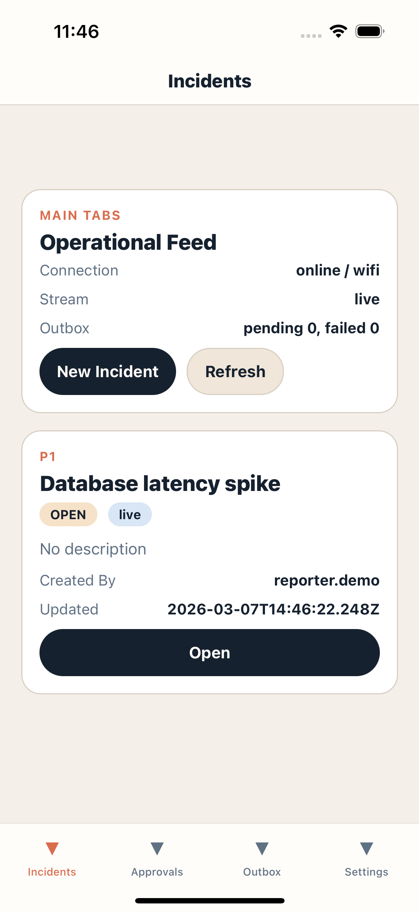

### Slide 5. Reporter Detail

detail 화면은 incident state, approval linkage, outbox overlay, audit timeline을 한곳에 모은다.
즉, 단일 상세 화면이 제품 UI이면서 동시에 운영 상태를 설명하는 대시보드다.

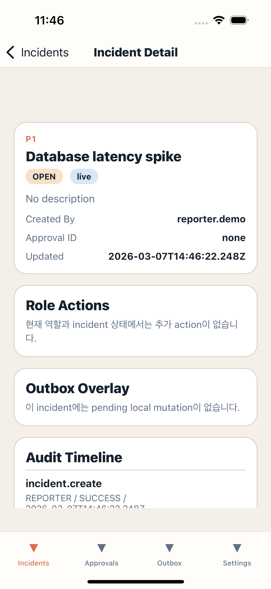

### Slide 6. Operator Ack

이제 operator로 로그인해 role-based action 제어를 보여준다.
같은 incident라도 reporter에게는 보이지 않던 `Queue Ack`가 operator에게만 노출된다.

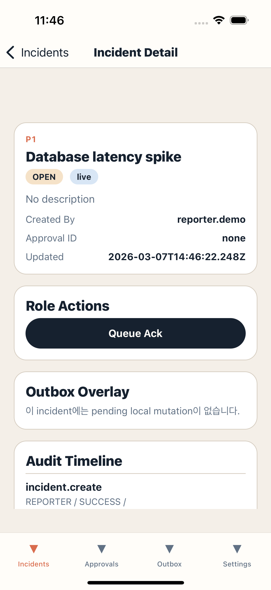

### Slide 7. Resolution Request

ack 이후에는 상태가 바뀌고, 다음 가능한 액션도 바뀐다.
여기서 “화면이 role뿐 아니라 workflow state를 따라 action set을 바꾼다”는 점을 강조하면 좋다.

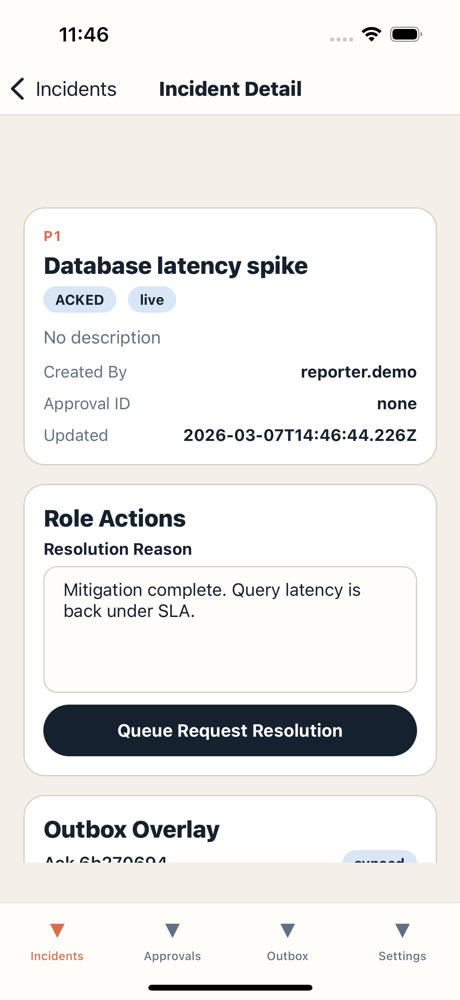

### Slide 8. Approver Queue

approver는 incident feed 전체를 훑지 않고 approvals 탭에서 승인 대기 항목만 빠르게 볼 수 있다.
이 장면은 제품적인 정보 구조를 설명하기 좋다.

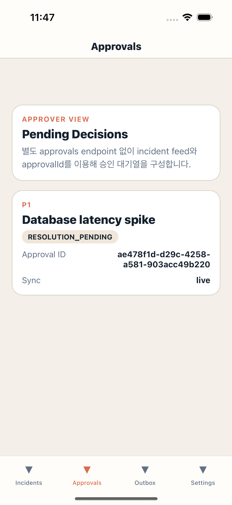

### Slide 9. Approval Decision

approver detail에서는 approve/reject action이 incident state와 approval linkage를 함께 바꾼다.
발표에서는 “모바일 화면에서 권한, 도메인 규칙, 서버 계약이 한 번에 만난다”고 설명하면 된다.

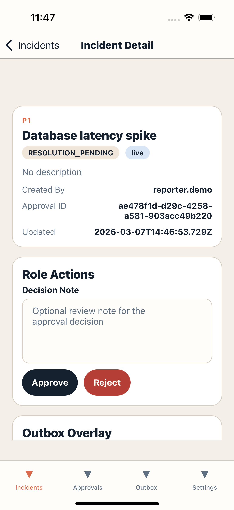

### Slide 10. Audit Evidence

승인 후에는 incident가 `RESOLVED`로 바뀌고 audit timeline이 남는다.
이 장면은 단순 성공 화면이 아니라 “누가 어떤 순서로 어떤 결정을 내렸는지”를 남기는 운영 증거 화면이다.

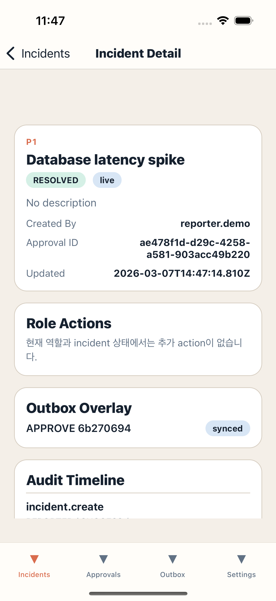

### Slide 11. Failure Injection

두 번째 데모는 의도적으로 backend target을 잘못 지정해 outbox failure를 재현하는 장면이다.
실제 모바일 환경의 네트워크 불안정성을 제품 UI에서 어떻게 다루는지 보여주는 핵심 장면이다.

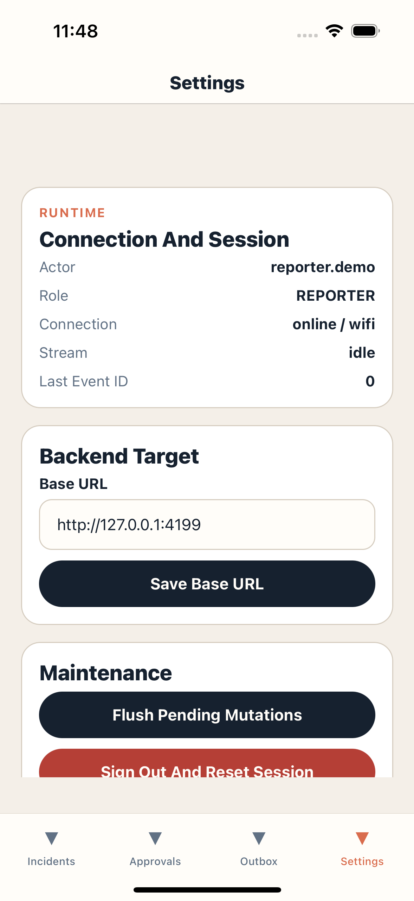

### Slide 12. Pending Outbox

backend에 도달하지 못하면 mutation은 사라지지 않고 outbox에 남는다.
실패 횟수, 마지막 에러, retry entrypoint가 모두 화면에 드러나므로 “오프라인 친화적 제품 UX”를 설명하기 좋다.


### Slide 13. Recovery

정상 base URL로 복구한 뒤 flush를 실행하면 outbox가 `synced` 상태로 정리된다.
이 장면으로 발표를 마무리하면 “장애를 재현했고, 앱 안에서 복구까지 증명했다”는 인상을 남길 수 있다.

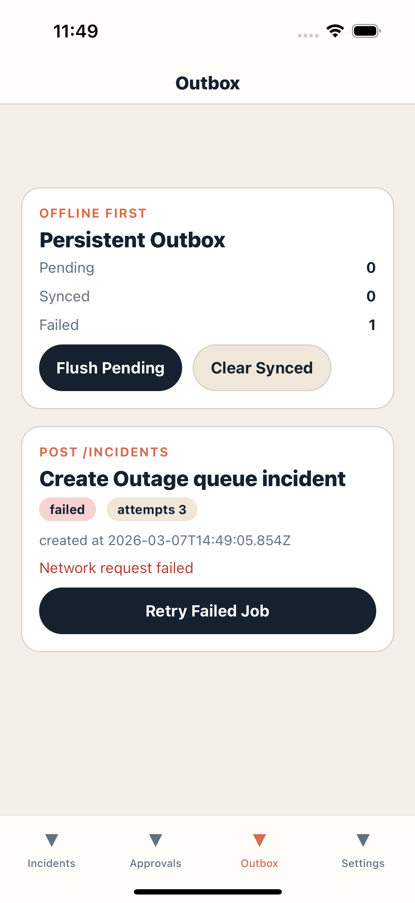

## Closing Message

발표 마지막 문장은 아래 형태가 적절하다.

> 이 프로젝트는 단순히 React Native 화면을 만든 것이 아니라,
> role-based workflow, persistent outbox, replay cursor, shared contract를
> 하나의 모바일 제품 경험으로 묶은 완성작입니다.

## Reproduction Commands

```bash
cd study/capstone/02-incident-ops-mobile-client/node-server
npm install
npm start
```

새 터미널:

```bash
cd study/capstone/02-incident-ops-mobile-client/react-native
npm install
npm start -- --reset-cache
npx react-native run-ios --simulator "iPhone 16" --no-packager
```

새 터미널:

```bash
export PATH="$PATH:$HOME/.maestro/bin"
maestro test maestro/01-portfolio-core.yaml --device "<simulator-udid>" --test-output-dir ../docs/assets/portfolio
maestro test maestro/02-portfolio-outbox-recovery.yaml --device "<simulator-udid>" --test-output-dir ../docs/assets/portfolio
```
