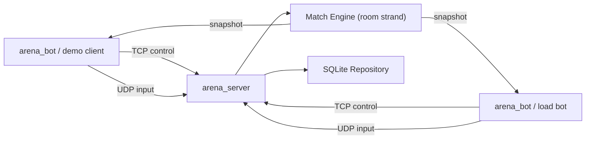
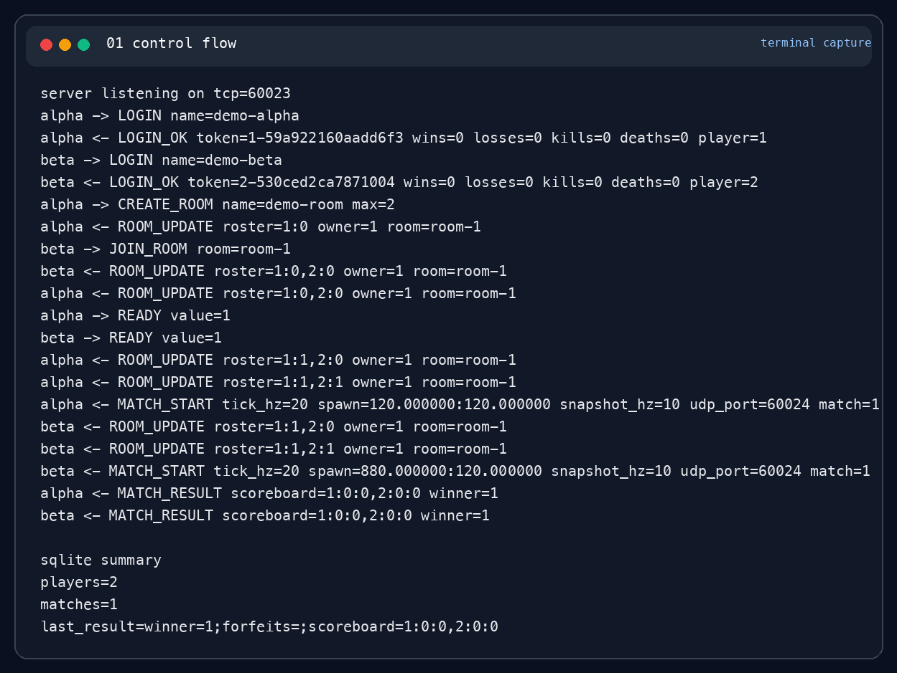
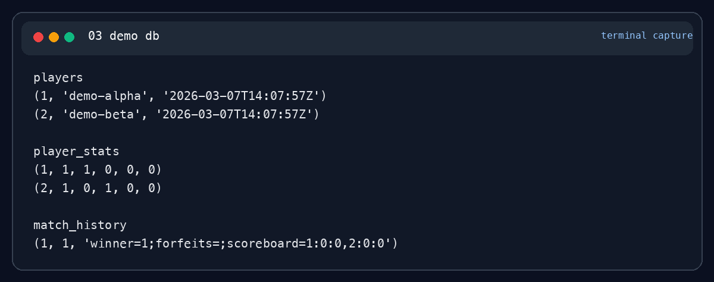
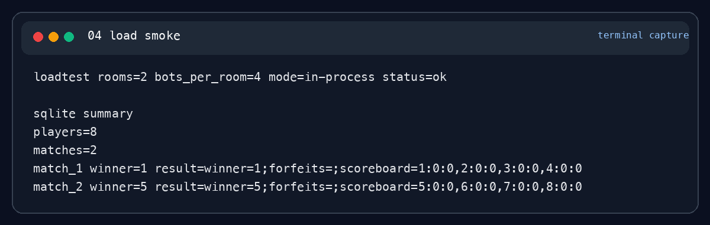

# Tactical Arena Server 발표 문서

이 문서는 `Tactical Arena Server` capstone을 포트폴리오 발표용으로 바로 사용할 수 있게 정리한 slide-style Markdown이다.

## 발표 목표

- 이 프로젝트가 기존 `study/` 과제와 같은 품질 기준을 충족한다는 점을 설명한다.
- authoritative game server로서 어떤 문제를 풀었는지 짧게 보여준다.
- 실제 실행 장면과 DB 반영, load smoke를 캡처로 제시한다.

## 품질 판단

기존 과제들과 같은 수준을 만족한다. 근거는 아래 네 가지다.

1. 공개 구조가 분리되어 있다.
   `problem/`, `cpp/`, `docs/`, `notion/`, `notion-archive/`의 역할이 명확하고 README가 이를 설명한다.
2. canonical 검증이 있다.
   `make -C study/05-Game-Server-Capstone/tactical-arena-server/problem test`가 unit + integration + load smoke를 한 번에 검증한다.
3. 공개 문서와 학습 노트가 함께 있다.
   `docs/`는 오래 남길 설명을, `notion/`은 현재 기준 문제 framing/디버그/회고를, `notion-archive/`는 이전 형식 백업을 담는다.
4. 재현 가능한 실행 시나리오가 있다.
   `run-bot-demo`, `presentation_capture.py`, `presentation_load_capture.py`로 발표 장면을 다시 만들 수 있다.

## 발표 시나리오

### Slide 1. 문제 정의

`Tactical Arena Server`는 TCP 제어 채널, UDP 입력 채널, fixed tick simulation, reconnect, SQLite persistence를 한 C++ capstone으로 묶은 프로젝트다.

### Slide 2. 왜 이 프로젝트를 했는가

기존 과제들은 프로토콜과 진단 도구를 잘게 나눠 학습하게 하지만, 그 지식을 실제 서버 설계 판단으로 설명하는 최종 프로젝트는 없었다. 이 capstone은 그 공백을 메운다.

### Slide 3. 아키텍처



발표 멘트:
- TCP와 UDP를 의도적으로 분리했다.
- match state는 room strand에서만 수정한다.
- SQLite는 공유 연결 하나를 repository mutex로 직렬화한다.

### Slide 4. Demo Scenario

1. control protocol transcript로 방 생성, 참가, ready, match start, match result를 보여준다.
2. scripted two-bot demo 결과를 보여준다.
3. SQLite에 전적과 match history가 남는지 보여준다.
4. 8 bots / 2 rooms load smoke를 보여준다.

### Slide 5. Control Flow Capture

실행 명령:

```bash
python3 problem/script/presentation_capture.py cpp/build
```



발표 멘트:
- `LOGIN -> CREATE_ROOM/JOIN_ROOM -> READY -> MATCH_START -> MATCH_RESULT` 흐름이 전부 실제 서버에서 나온 값이다.
- 마지막 `sqlite summary`까지 한 장에서 보여 주기 때문에 "동작했다"와 "저장됐다"를 같이 설명할 수 있다.

### Slide 6. Two-Bot Demo Capture

실행 명령:

```bash
cd problem
bash script/run_bot_demo.sh ../cpp/build
```


발표 멘트:
- GUI 없이도 두 bot이 실제 match를 끝내고 `MATCH_RESULT`를 출력한다.
- 발표에서는 이 장면을 "가장 짧은 end-to-end demo"로 쓰면 된다.

### Slide 7. Persistence Capture

실행 후 조회:

```bash
python3 - <<'PY'
import sqlite3
conn = sqlite3.connect('problem/data/demo.sqlite3')
...
PY
```



발표 멘트:
- `players`, `player_stats`, `match_history`가 모두 갱신된다.
- 이 장면으로 authoritative match 결과가 persistence까지 이어진다는 점을 확인시킨다.

### Slide 8. Load Smoke Capture

실행 명령:

```bash
python3 problem/script/presentation_load_capture.py cpp/build
```



발표 멘트:
- 8 bots / 2 rooms smoke가 `status=ok`로 끝난다.
- 결과 DB에서 players 8, matches 2를 바로 확인한다.
- 이 장면으로 "단일 데모"가 아니라 "여러 세션 동시 처리"까지 보여준다.

### Slide 9. 구현 중 해결한 핵심 문제

- forfeit는 기록되지만 승자가 틀리던 comparator 문제
- multi-threaded TCP session I/O race
- SQLite shared connection race
- `ROOM_UPDATE -> READY` echo loop
- 외부 프로세스 래퍼 기반 loadtest 불안정성

현재 기준 정리는 [`../../notion/02-debug-log.md`](../../notion/02-debug-log.md)에 있고, 이전 형식 기록은 [`../../notion-archive/`](../../notion-archive/)에 남겨 두었다.

### Slide 10. 한계와 다음 단계

- nonce 기반 UDP endpoint proof는 light-weight 수준
- snapshot delta compression 미구현
- spectator, replay, distributed matchmaker 미구현

발표 멘트:
- 지금 프로젝트의 목표는 상용 운영 완성이 아니라 "설명 가능한 authoritative server"다.
- 다음 단계는 spectator/replay/delta snapshot 중 하나를 좁게 추가하는 쪽이 적절하다.

## 캡처 재생성 명령

```bash
cmake -S study/05-Game-Server-Capstone/tactical-arena-server/cpp -B study/05-Game-Server-Capstone/tactical-arena-server/cpp/build
cmake --build study/05-Game-Server-Capstone/tactical-arena-server/cpp/build
python3 study/05-Game-Server-Capstone/tactical-arena-server/problem/script/presentation_capture.py study/05-Game-Server-Capstone/tactical-arena-server/cpp/build
python3 study/05-Game-Server-Capstone/tactical-arena-server/problem/script/presentation_load_capture.py study/05-Game-Server-Capstone/tactical-arena-server/cpp/build
```

## 캡처 생성일

- `2026-03-07`
